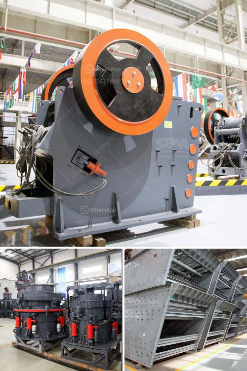

<h3>small gold ore crusher grinder</h3>
Gold ore has quickly become a valuable commodity in today's mining industry. With the demand for gold steadily rising, more and more miners are looking for ways to extract and process the ore efficiently. One method that has gained popularity is the use of small gold ore crusher grinders.

A small gold ore crusher grinder is a machine that breaks down gold ore into fine dust particles for further processing. It works by applying mechanical force to break the ore into smaller pieces. The grinder is powered by electricity or diesel and is typically used in small-scale mining operations.

One of the key advantages of using a small gold ore crusher grinder is its portability. Unlike large crushers and grinders that require heavy machinery to transport, a small crusher grinder can be easily carried to the mining site. This allows miners to set up and start processing ore quickly without the need for expensive infrastructure.

Another advantage of using a small crusher grinder is its cost-effectiveness. These machines are usually affordable, making them accessible to small-scale miners with limited financial resources. Additionally, their low operating costs make them a viable option for miners looking to maximize their profits.

The process of using a small gold ore crusher grinder begins with the loading of the ore into the machine. The ore is fed into the grinder's hopper, where it is crushed into smaller particles by a set of rotating blades or hammers. The crushed ore is then discharged through a screen, with the desired size particles collected for further processing.

After being ground, the gold ore can be further processed using various techniques, such as gravity separation, flotation, or leaching. These processes aim to separate the gold from the ore and extract it in its pure form. The small gold ore crusher grinder serves as a crucial first step in this overall process.

When selecting a small gold ore crusher grinder, there are several factors to consider. Firstly, the size and hardness of the ore should be taken into account. This will determine the power and capacity requirements of the machine. Additionally, the durability and reliability of the grinder should be considered to ensure smooth and uninterrupted operations.

In conclusion, a small gold ore crusher grinder is a valuable tool for miners looking to efficiently process and extract gold ore. Its portability and cost-effectiveness make it a suitable option for small-scale mining operations. By breaking down the ore into smaller particles, these machines pave the way for further processing and extraction of gold. Whether used as a standalone device or integrated into a larger mining setup, a small gold ore crusher grinder proves to be a worthy investment for miners seeking to maximize their returns.
<h3>Contact us</h3><ul><li><strong>Whatsapp:&nbsp;<a href="https://wa.me/8613661969651">+8613661969651</a></strong></li><li><a href="https://swt.shibang-china.com/?git&amp;zhl&amp;small gold ore crusher grinder"><strong>Online Service(chat now)</strong></a></li></ul><h3>Related</h3><ul><li><a href='quartz crusher manufacturing process.md'>quartz crusher manufacturing process</a></li><li><a href='limestone treatment plant.md'>limestone treatment plant</a></li><li><a href='jaw crushers china.md'>jaw crushers china</a></li><li><a href='principles of granite quarry operations.md'>principles of granite quarry operations</a></li><li><a href='calculating capacity of a roll crusher.md'>calculating capacity of a roll crusher</a></li></ul>