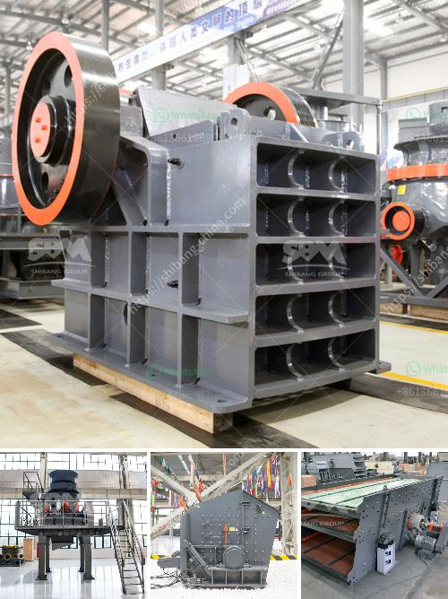

<h3>small gold ore jaw crushers</h3>
Small gold ore jaw crushers are designed to crush rock and stone in the mining, quarrying and recycling industries. These machines are compact and can be operated in confined spaces, making them highly efficient and versatile choices for processing smaller quantities of materials.

The gold ore jaw crusher incorporates advanced technology to process gold ore at high efficiency and low cost. These crushers feature a deep symmetrical crushing chamber, easy settings adjustment, a large feed opening for its size, and an ideal nip angle that offers smooth material flow and high reduction efficiency.

One of the main advantages of the gold ore jaw crusher is its ability to crush materials of different hardness and sizes. This versatility makes it an ideal choice for various applications, including recycling, demolition, quarrying, and mining. Whether the material is soft or hard, large or small, the gold ore jaw crusher can easily process it.

In addition to being versatile, gold ore jaw crushers are also durable and reliable machines. They are built with high-quality materials and components that ensure long-lasting performance and low maintenance requirements. These crushers are designed to handle heavy-duty applications and can withstand the harshest conditions, making them suitable for use in harsh environments like mines and quarries.

Another advantage of the gold ore jaw crusher is its compact size. These crushers are typically smaller than traditional primary crushers, which makes them more suitable for processing small quantities of materials. Their compact design also makes them easy to transport and maneuver, allowing operators to bring the crusher closer to the material source, reducing haulage costs.

Despite their small size, gold ore jaw crushers are powerful machines that can efficiently process gold ore. The crushing mechanism used by these machines is similar to that of larger jaw crushers. They consist of a fixed jaw plate and a movable jaw plate, which move in a V-shaped arrangement to compress the material against the fixed jaw plate. This creates a crushing action that reduces the size of the gold ore.

The crushed material then exits the crushing chamber through the bottom discharge opening, which can be adjusted to control the size of the final product. The crushed material can be further processed using other equipment, such as cone crushers or impact crushers, to achieve the desired size and shape.

Overall, small gold ore jaw crushers offer a cost-effective and environmentally friendly solution for processing gold ore. They are compact, durable, and highly efficient, making them a valuable asset in any mining operation. These crushers are versatile machines that can handle various types of materials and deliver consistent performance, making them an excellent choice for small-scale processing operations. Whether used in recycling, quarrying, or mining, small gold ore jaw crushers are reliable workhorses that can process gold ore efficiently and effectively.
<h3>Contact us</h3><ul><li><strong>Whatsapp:&nbsp;<a href="https://wa.me/8613661969651">+8613661969651</a></strong></li><li><a href="https://swt.shibang-china.com/?git&amp;zhl&amp;small gold ore jaw crushers"><strong>Online Service(chat now)</strong></a></li></ul><h3>Related</h3><ul><li><a href='vibrating screen separator suppliers in philippines.md'>vibrating screen separator suppliers in philippines</a></li><li><a href='vibrating screen efficiency.md'>vibrating screen efficiency</a></li><li><a href='gypsum board making plant from germany.md'>gypsum board making plant from germany</a></li><li><a href='200 ton crusher price.md'>200 ton crusher price</a></li><li><a href='aggregate manufacturing process.md'>aggregate manufacturing process</a></li></ul>