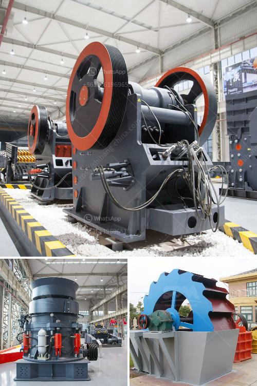

<h3>small gravel crusher machine ethiopia</h3>
Small Gravel Crusher Machine Ethiopia: The efficient and versatile design of Ethiopia small gravel crusher machine offers producers the flexibility to handle a wide variety of materials including quarry rock, gravel, limestone, concrete, asphalt and other minerals. The portable gravel crusher can be mounted as a standalone unit or as a multi-stage process, enabling the production of two or three different finished products.

Recently, many customers in Ethiopia have asked about the gravel crusher machinery. As an established manufacturer of mining and construction machinery, SBM has been working on the development of high-efficiency gravel crushers for a long time. Our small gravel crusher machine is available with various specifications, such as power, capacity, and weight to meet different crushing needs.

The gravel crushers in Ethiopia can be divided into three types: portable, stationary, and mobile. Our portable crushing plant is widely used in mining ore crushing, construction waste recycling, construction aggregate production, highway, railway, road and bridge construction and other industries. It truly provides customers with efficient and low-cost hardware facilities for project operation.

With their high performance, high reduction ratios and perfect cubic-shaped final products, small gravel crusher machines are ideal for secondary and tertiary crushing applications. The machine features a robust design, which ensures durability and longevity. The unique crushing chamber design offers increased capacity and excellent end-product quality in all rock conditions.

Furthermore, the small gravel crusher machine Ethiopia is easy to operate and maintain. It consists of a fixed and a moving plate, which allows for rapid replacement of worn parts. As the material is pressed between the plates, it is reduced in size, resulting in a uniform product size distribution. Additionally, the machine is equipped with a hydraulic system that allows for easy adjustment of the crusher settings.

In conclusion, the small gravel crusher machine Ethiopia offers significant advantages over traditional crushers, including higher efficiency, reduced downtime, and improved flexibility. The machine is also capable of producing a wide range of finished products, making it suitable for various applications. With its easy operation and maintenance, it is a cost-effective solution for gravel crushing in Ethiopia.
<h3>Contact us</h3><ul><li><strong>Whatsapp:&nbsp;<a href="https://wa.me/8613661969651">+8613661969651</a></strong></li><li><a href="https://swt.shibang-china.com/?git&amp;zhl&amp;small gravel crusher machine ethiopia"><strong>Online Service(chat now)</strong></a></li></ul><h3>Related</h3><ul><li><a href='mobile crushing and screening plant for sale.md'>mobile crushing and screening plant for sale</a></li><li><a href='for sale prices jaw crushe.md'>for sale prices jaw crushe</a></li><li><a href='conveyor belts in peru.md'>conveyor belts in peru</a></li><li><a href='aggregates crushers for sale.md'>aggregates crushers for sale</a></li><li><a href='barite powder machine.md'>barite powder machine</a></li></ul>