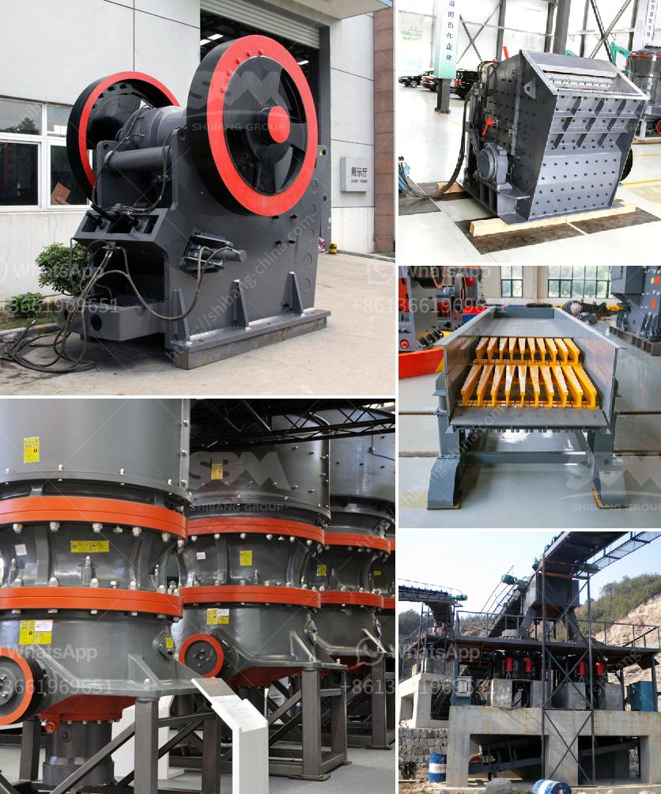

<h3>small hammer crusher</h3>
In the construction industry, we often come across various types of waste materials generated from different sources. These waste materials can range from concrete debris to bricks, tiles, and even wood. Disposing of such waste materials can be expensive and time-consuming. But with the introduction of small hammer crushers, the process of waste disposal has become more accessible and cost-effective.

A small hammer crusher is the perfect solution for small-scale construction projects or renovation projects. With its high efficiency and compact design, it takes up minimal space and offers reliable performance. This mini crusher is ideal for crushing all types of construction waste, including concrete debris, bricks, tiles, and more.

One of the significant advantages of the small hammer crusher is its versatility. It can be used for both primary and secondary crushing, making it suitable for various applications. Whether you need to crush materials to a specific size or want to reduce the size of waste materials for easier disposal, this hammer crusher can handle it all.

Another feature that makes the small hammer crusher popular among contractors is its portability. Its compact size and lightweight design allow for easy transportation and installation. You can move it from one job site to another effortlessly, making it an ideal option for those working on multiple projects simultaneously.

In terms of performance, the small hammer crusher delivers impressive results. With its powerful motor and sturdy construction, it can crush materials efficiently and effectively. The adjustable discharge size ensures that you can achieve the desired product size for your specific requirements.

Moreover, the small hammer crusher is also easy to maintain. Regular inspections and proper cleaning will keep it in good working condition for years to come. It requires minimal lubrication, further reducing maintenance costs.

In conclusion, the small hammer crusher is an essential tool for construction professionals looking to streamline their waste disposal process. Its compact design, versatility, and portability make it an excellent investment for anyone working on small-scale construction projects. Experience the convenience and cost-effectiveness of this mini crusher, and say goodbye to your construction waste worries.
<h3>Contact us</h3><ul><li><strong>Whatsapp:&nbsp;<a href="https://wa.me/8613661969651">+8613661969651</a></strong></li><li><a href="https://swt.shibang-china.com/?git&amp;zhl&amp;small hammer crusher"><strong>Online Service(chat now)</strong></a></li></ul><h3>Related</h3><ul><li><a href='mobile stone jaw crusher equipment.md'>mobile stone jaw crusher equipment</a></li><li><a href='cost of a manganese processing plant in south africa.md'>cost of a manganese processing plant in south africa</a></li><li><a href='ethiopia crusher jaw crusher.md'>ethiopia crusher jaw crusher</a></li><li><a href='mine to mill optimization and reconciliation.md'>mine to mill optimization and reconciliation</a></li><li><a href='gypsum manufacturer in ethiopia.md'>gypsum manufacturer in ethiopia</a></li></ul>