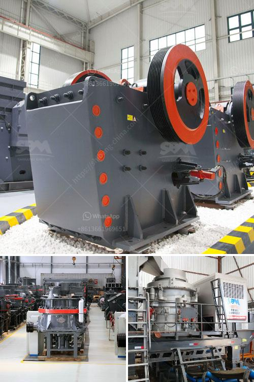

<h3>small impact gold mill australia</h3>
Australia has long been known for its rich mineral resources, and gold has always held a special place in the country's heart. With a history dating back to the 1850s gold rush, mining has contributed significantly to Australia's economic growth and development. However, in recent years, a shift towards more sustainable and responsible mining practices has emerged. One such example is the rise of small impact gold mills in Australia.

Traditionally, gold mining operations have been associated with extensive environmental degradation. Large-scale mining operations often used technologies that caused substantial erosion, water pollution, and habitat destruction. Additionally, the large carbon footprint attributed to these operations further added to the environmental impact. However, the emergence of small impact gold mills is changing the game.

Small impact gold mills emphasize sustainable practices such as low carbon emissions, reduced water usage, and responsible waste management. These mills employ technologically advanced equipment and processes to minimize their impact on the environment. They aim to achieve a balance between economic viability and environmental stewardship, ensuring that future generations can also benefit from Australia's gold resources.

One of the key features of small impact gold mills is their efficient use of water resources. Water scarcity is a significant concern in many parts of Australia, and irresponsible mining practices exacerbate this issue. However, small impact gold mills prioritize water conservation by implementing closed-circuit systems and recycling water wherever possible. By greatly reducing water consumption, these mills not only lessen their environmental impact but also contribute to the sustainability of surrounding communities.

Furthermore, small impact gold mills integrate innovative technology to minimize carbon emissions. For instance, they utilize solar power and energy-efficient machinery, reducing their reliance on fossil fuels. This shift towards renewable energy sources significantly lowers carbon emissions associated with gold milling operations. By embracing clean energy solutions, small impact gold mills showcase a commitment to combatting climate change while continuing to extract precious resources.

Another crucial aspect of these mills is responsible waste management. Mining operations often generate vast amounts of waste materials, including toxic sediments and harmful chemicals. However, small impact gold mills implement strategies to minimize waste production and properly dispose of any generated waste. By adhering to stringent regulatory standards and employing environmentally friendly practices, these mills protect ecosystems and preserve the overall environmental integrity of the region.

The emergence of small impact gold mills in Australia has not only resulted in a reduced environmental footprint but has also inspired the industry as a whole to adopt responsible practices. The success and sustainability of these small mills have served as shining examples for larger mining operations to follow suit. As a result, the entire sector is gradually shifting towards more sustainable practices, ensuring the long-term viability of Australia's mining industry.

In conclusion, small impact gold mills in Australia are at the forefront of sustainable mining practices. Through the implementation of efficient water usage, renewable energy adoption, and responsible waste management, these mills are redefining the industry's approach to gold mining. Their commitment to environmental stewardship sets a positive precedent for the mining sector, ensuring that Australia's gold resources can be extracted while preserving the natural environment for future generations.
<h3>Contact us</h3><ul><li><strong>Whatsapp:&nbsp;<a href="https://wa.me/8613661969651">+8613661969651</a></strong></li><li><a href="https://swt.shibang-china.com/?git&amp;zhl&amp;small impact gold mill australia"><strong>Online Service(chat now)</strong></a></li></ul><h3>Related</h3><ul><li><a href='zirconia powder ball mill plant.md'>zirconia powder ball mill plant</a></li><li><a href='gold washing machine.md'>gold washing machine</a></li><li><a href='how much is scm series ultrafine mill machine in usa.md'>how much is scm series ultrafine mill machine in usa</a></li><li><a href='kaolin processing unit.md'>kaolin processing unit</a></li><li><a href='coal mill hydraulic system principles.md'>coal mill hydraulic system principles</a></li></ul>