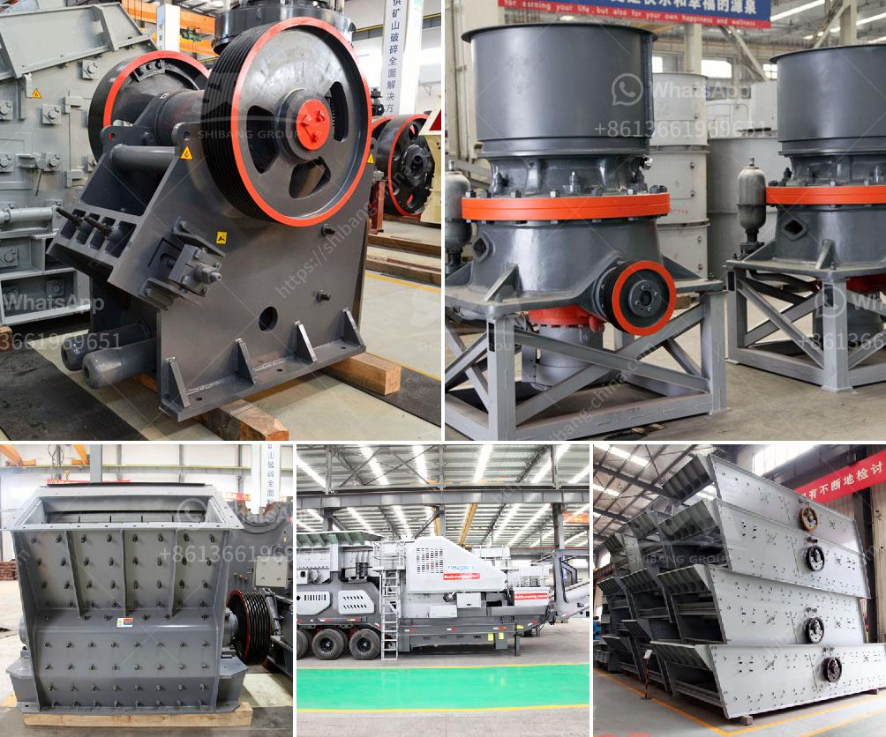

<h3>small jaw crusher for sale in california</h3>
As the demand for small jaw crushers continues to rise in the mining and construction industry, the importance of finding affordable and reliable equipment cannot be underestimated. These compact crushers are ideal for contractors who require a powerful machine to crush materials on site, while offering easy maneuverability and transportation.

California is known for its thriving mining and construction industry, making it the perfect location to find high-quality small jaw crushers for sale. With a range of options available, it's important to consider the specific needs of your project, such as the type of material you're crushing and the desired output size.

One of the key benefits of a small jaw crusher is its portability. These machines are compact, lightweight, and can be easily transported from one job site to another. This makes them an excellent choice for contractors who need to move between different locations frequently.

Additionally, small jaw crushers are energy-efficient and cost-effective. They have a low operating cost, allowing you to maximize your profits without compromising on the quality of your end product. Whether you're crushing concrete, rock, or other materials, a small jaw crusher is designed to deliver consistent results.

When purchasing a small jaw crusher in California, it's essential to choose a reputable supplier. Look for a manufacturer that has a proven track record and offers excellent customer support. They should provide you with all the necessary information, such as specifications and pricing, to help you make an informed decision.

In conclusion, small jaw crushers are a versatile and reliable solution for contractors in California and beyond. With their compact size, ease of use, and affordability, these machines offer great value for money. If you're in the market for a small jaw crusher for your next project, be sure to explore the options available in California.
<h3>Contact us</h3><ul><li><strong>Whatsapp:&nbsp;<a href="https://wa.me/8613661969651">+8613661969651</a></strong></li><li><a href="https://swt.shibang-china.com/?git&amp;zhl&amp;small jaw crusher for sale in california"><strong>Online Service(chat now)</strong></a></li></ul><h3>Related</h3><ul><li><a href='ouedkniss station concassage.md'>ouedkniss station concassage</a></li><li><a href='small gravel crusher machine ethiopia.md'>small gravel crusher machine ethiopia</a></li><li><a href='jaw crusher terminator.md'>jaw crusher terminator</a></li><li><a href='river pebble crusher.md'>river pebble crusher</a></li><li><a href='bauxite crushing processing equipments.md'>bauxite crushing processing equipments</a></li></ul>