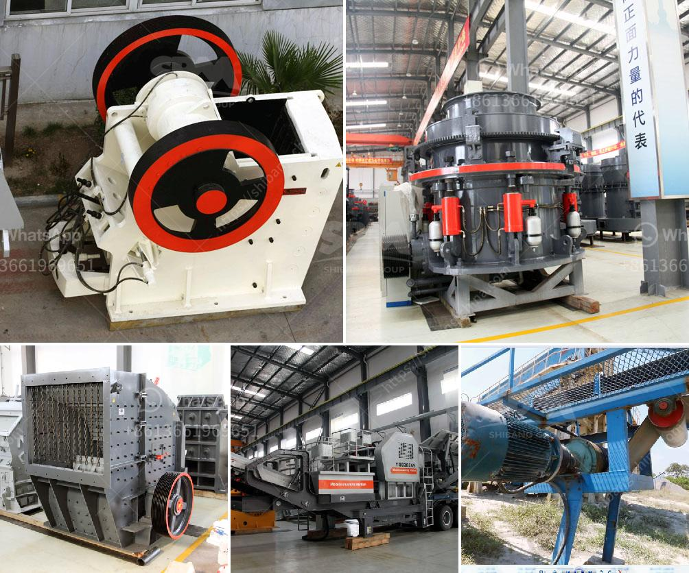

<h3>small mining equipment price in south africa</h3>
The mining industry in South Africa has been a key driver of economic growth and job creation for centuries. However, with the depletion of some of the country's major mineral resources and the increasing difficulty of mining deeper and narrower ore bodies, mining companies are increasingly turning to smaller and more efficient equipment to maximize productivity and minimize costs.

Small mining equipment, also known as small-scale mining equipment, is tailored specifically for artisanal and small-scale miners. With limited capital investment and a simplified process, small-scale mining can be a cost-effective way to extract minerals. In South Africa, artisanal and small-scale mining (ASM) provides employment opportunities for about 10% of the country's population and contributes significantly to poverty alleviation.

One of the main advantages of small mining equipment is its affordability. Compared to large-scale mining equipment, which can cost millions of rands, small-scale mining equipment is much more accessible to individual miners or small mining communities. Entry-level equipment such as crushers, pulverizers, and mills can be purchased at relatively low prices, allowing miners to bootstrap their operations and gradually scale up as they secure more funding or access to additional resources.

The price of small mining equipment in South Africa varies widely depending on the type and functionality required. For example, a small jaw crusher equipped with a diesel engine may cost around R70,000 while a specialized ore processing setup can cost up to R700,000 or more. However, it is important to emphasize that each mining operation is unique, and the equipment needs to be tailored to the specific requirements of the deposit being targeted.

Equipment suppliers and manufacturers in South Africa offer a wide range of small mining equipment options suitable for various mineral commodities. Some of the most common types of equipment include crushers, mills, concentrators, and water pumps. These tools allow miners to extract and process various minerals such as gold, platinum, diamonds, and coal. The equipment is designed to handle smaller quantities of material compared to industrial-scale equipment, making it ideal for smaller operations with limited resources.

Aside from the initial purchase price, operators of small mining equipment should also consider ongoing operating and maintenance costs. Efficient operation and regular maintenance can extend the lifespan of the equipment and ensure reliable performance. Equipment suppliers often provide training and support services to assist operators in optimizing their operations and addressing any challenges they may encounter.

In conclusion, small mining equipment plays a vital role in South Africa's mining industry, particularly for artisanal and small-scale miners. These equipment options provide affordable alternatives to large-scale equipment and enable miners to extract minerals in a cost-effective and sustainable manner. By investing in small mining equipment, individuals and communities can unlock economic opportunities and contribute to the socio-economic development of South Africa.
<h3>Contact us</h3><ul><li><strong>Whatsapp:&nbsp;<a href="https://wa.me/8613661969651">+8613661969651</a></strong></li><li><a href="https://swt.shibang-china.com/?git&amp;zhl&amp;small mining equipment price in south africa"><strong>Online Service(chat now)</strong></a></li></ul><h3>Related</h3><ul><li><a href='cara menghitung biaya pemasangan stone crusher plant.md'>cara menghitung biaya pemasangan stone crusher plant</a></li><li><a href='calcium carbonate milling plant in turkey.md'>calcium carbonate milling plant in turkey</a></li><li><a href='crusher plants in sri lanka.md'>crusher plants in sri lanka</a></li><li><a href='rock crusher for granite.md'>rock crusher for granite</a></li><li><a href='100tph rock plant used for sale.md'>100tph rock plant used for sale</a></li></ul>