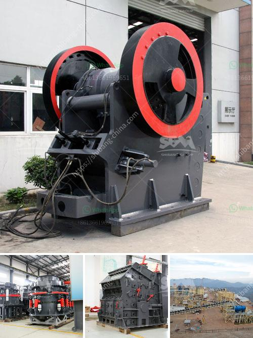

<h3>small mobile limestone crushers</h3>
Limestone is a sedimentary rock that is mainly composed of calcium carbonate (CaCO3), in the form of mineral calcite. It is highly versatile and has been used for centuries in a variety of applications, from construction and agriculture to industrial processes. In the construction industry, limestone is often used as an aggregate in concrete and asphalt mixtures, as well as a base material for roads and buildings. As such, the demand for limestone products has been increasing, which has led to the development of small mobile limestone crushers.

Small mobile limestone crushers are indispensable machines in the mining and quarrying industry. They not only produce high-quality materials but also greatly reduce the transportation cost of materials. Limestone is an important mineral resource in the construction industry and other industries that require large quantities of raw materials, such as cement production, steel production, and chemical manufacturing. Therefore, the demand for limestone crushers is continuously growing.

One of the main advantages of small mobile limestone crushers is their compactness. Unlike large-scale crushers, small mobile crushers can be transported easily and installed in tight spaces. This makes them ideal for homeowners and small construction companies that have limited space and need to access remote areas. Whether it is a backyard renovation project or a small-scale construction site, these crushers can easily handle the job.

Another advantage of small mobile limestone crushers is their flexibility. They can be used in various applications, such as crushing hard or soft stones, concrete, and asphalt. This versatility allows them to be used in different projects, regardless of the material requirements. Additionally, some small mobile crushers come equipped with screens, allowing the operator to control the size of the desired output. This makes it easier to produce different sizes of material, depending on the specific needs of the project.

In terms of efficiency and productivity, small mobile limestone crushers are no less than their larger counterparts. They are equipped with advanced technologies, such as hydraulic systems and electric motors, which ensure smooth operation and high performance. Additionally, they are designed with user-friendly controls, making them easy to operate and maintain. This allows homeowners and small construction companies to maximize productivity without the need for extensive training or specialized knowledge.

Moreover, small mobile limestone crushers are environmentally friendly. They are powered by electricity or diesel, which reduces the emissions of greenhouse gases and air pollutants. This is especially important in today's world, where sustainable practices are increasingly valued. Furthermore, the compact size of these crushers reduces the need for transportation, which in turn reduces carbon emissions and traffic congestion on the roads.

In conclusion, small mobile limestone crushers offer a perfect solution for homeowners and small construction companies. Their compactness, versatility, efficiency, and environmental friendliness make them ideal for a wide range of projects. Whether it is a backyard renovation or a small-scale construction site, these crushers can meet the needs of any project while minimizing costs and environmental impact. As the demand for limestone products continues to grow, small mobile crushers are becoming an essential tool for those looking to extract and process limestone efficiently.
<h3>Contact us</h3><ul><li><strong>Whatsapp:&nbsp;<a href="https://wa.me/8613661969651">+8613661969651</a></strong></li><li><a href="https://swt.shibang-china.com/?git&amp;zhl&amp;small mobile limestone crushers"><strong>Online Service(chat now)</strong></a></li></ul><h3>Related</h3><ul><li><a href='grinding equipment and machinery.md'>grinding equipment and machinery</a></li><li><a href='feasibility study for gypsum processing plant pdf.md'>feasibility study for gypsum processing plant pdf</a></li><li><a href='cone crusher csd 900 price.md'>cone crusher csd 900 price</a></li><li><a href='quartz powder manufacturing machinery.md'>quartz powder manufacturing machinery</a></li><li><a href='copper ore complete concentrating method.md'>copper ore complete concentrating method</a></li></ul>