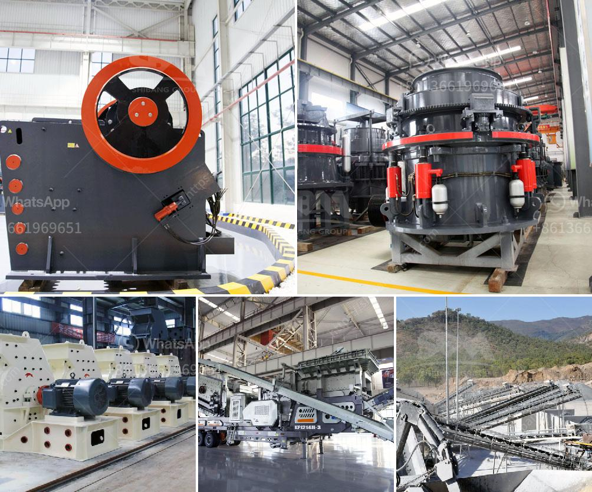

<h3>small portable rock crusher for sale africa</h3>
The small portable rock crusher for sale Africa has undoubtedly become a must-have for many mining enthusiasts looking to ramp up their processing operations. Whether you are in the business of mining minerals or you are a contractor looking for a versatile and efficient machine, this portable rock crusher is your ultimate solution.

As the name suggests, this crusher is small and can be easily transported from one place to another. Its compact design and lightweight nature make it ideal for work in remote locations or areas with limited access. You can easily load it onto a trailer or a truck and take it wherever it is needed. This mobility feature eliminates the need for costly transportation and saves you time and money.

The small portable rock crusher for sale Africa is powered by a diesel engine, ensuring the machine can function even in the absence of electricity. This means you can crush rocks in a remote location without worrying about power supply. Additionally, the diesel engine is renowned for its durability, making this crusher a long-term investment.

This portable rock crusher is capable of handling a variety of materials, such as granite, basalt, limestone, river rock, sandstone, and more. With a crushing capacity ranging from 80 to 150 tons per hour, this machine is perfect for small to medium-sized operations. The adjustable output size ensures you can produce material of the desired specifications.

Furthermore, the small portable rock crusher for sale Africa is equipped with advanced technology to enhance its performance. The machine features a hydraulic setting adjustment system, allowing you to easily adjust the crusher settings according to your specific needs. Additionally, the crusher is equipped with a feeding hopper, allowing you to load large quantities of material at once. The high-strength steel construction ensures the machine can handle heavy-duty applications without compromising its performance.

In conclusion, the small portable rock crusher for sale Africa is a perfect choice for mobile operations in the mining industry. Its compact design, portability, and versatility make it a valuable asset for mining enthusiasts. Whether you are processing minerals or are in need of a reliable machine for your construction projects, this crusher will exceed your expectations. The small portable rock crusher is a worthy investment that will deliver superior performance for years to come.
<h3>Contact us</h3><ul><li><strong>Whatsapp:&nbsp;<a href="https://wa.me/8613661969651">+8613661969651</a></strong></li><li><a href="https://swt.shibang-china.com/?git&amp;zhl&amp;small portable rock crusher for sale africa"><strong>Online Service(chat now)</strong></a></li></ul><h3>Related</h3><ul><li><a href='india dolomite grinding machine.md'>india dolomite grinding machine</a></li><li><a href='cost of 5 000 tpd cement project ore processing.md'>cost of 5 000 tpd cement project ore processing</a></li><li><a href='iron ore cruseher plant.md'>iron ore cruseher plant</a></li><li><a href='gypsum mining in garissa.md'>gypsum mining in garissa</a></li><li><a href='how to setup a stone quarry.md'>how to setup a stone quarry</a></li></ul>