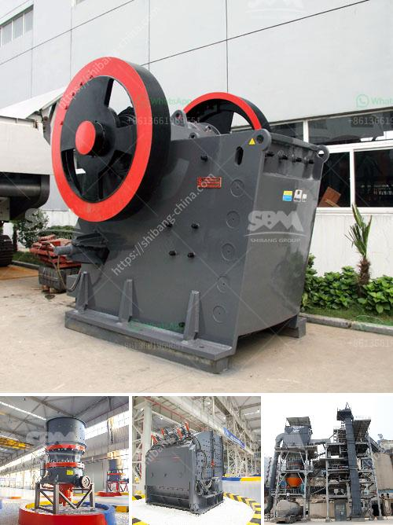

<h3>small rock crusher for sale</h3>
Small rock crusher, also called as mini stone crushing machine, is such a machine which is designed for the large rocks decrease becoming small rock, gravel, or rock dust. It will produce the gravel stones and the mining ores, or the filling material used to beautify and erosion control. They can be used with the cement making machine. Small rock crusher can move (though usually is very heavy), and it also can be fixed.

As China's economic construction is growing, the domestic real estate and high-speed way construction develops rapidly, which make small rock crusher industry has a rapid development. Small rock crusher production specifications will be from single crusher development to a variety of specifications and various types of a variety of small crusher. Compound crusher, one of the new types of small rock crusher, also develops gradually. It has a significantly improvement of compound rock crusher recent years.

Small rock crusher for sale is excellent for small scale crushing projects. The small scale rock crushing plants are widely used in quarry, mine, building and road construction, recycling applications etc. It can be easy move from one working site to another. To help our clients solve faults of sand making machine, Unique Company will share something with our clients, so that our clients have a better knowledge of this industry and avoid unnecessary trouble to achieve a larger profit.

1. Sand making machine -bearing overheating. Bearing overheating generally due to lack of lubricating agent is added resulting in bearing wear or bearing parts into the dust caused by the specific solution is to regularly bearing lubrication or cleaning agents bearing, replace damaged bearings, specific methods of adjustment, you can refer to the bearing manufacturer.

2. Sand making machine -crusher is broken, by a cone crusher or jaw crusher and a vibrating screen and other related components of the conveyor. According to the different needs of customers can provide different types of equipment. Another example is the breakingspeed single-stage machines, driven by two electric motors working in tandem to achieve the required motor power for a more efficient work.

3. Sand making machine- the finished product is too large. The benefit is that it can be adjusted according to the customers' needs or below. Below. In turn, the finished product is broken into small parts as a whole, simplifying the crushing process can make a more powerful fragmentation.

4. Sand making machine- static electricity in the dust will seriously affect the sand and gravel production efficiency of the equipment, resulting in a clean environment do not meet process requirements. Thus, in the purchase of the machine, wearing parts, discharge ports and dust removal should be checked to see whether intact, as well as good maintenance and replacement parts.

Small rock crusher has a wide range of application as mining equipment to crush hard gold ore, silver ore, iron ore, quartz stone, copper ore, marble and so on. you will gold washing plants for sale enjoy the guaranteed quality and considerate service. Please feel free to contact us for more information.
<h3>Contact us</h3><ul><li><strong>Whatsapp:&nbsp;<a href="https://wa.me/8613661969651">+8613661969651</a></strong></li><li><a href="https://swt.shibang-china.com/?git&amp;zhl&amp;small rock crusher for sale"><strong>Online Service(chat now)</strong></a></li></ul><h3>Related</h3><ul><li><a href='clay crusher manufacturing process.md'>clay crusher manufacturing process</a></li><li><a href='chrome ore refinery processing plant.md'>chrome ore refinery processing plant</a></li><li><a href='crusher prices stone crusher primary and secondary.md'>crusher prices stone crusher primary and secondary</a></li><li><a href='aggregates crushing plant in angat bulacan.md'>aggregates crushing plant in angat bulacan</a></li><li><a href='ball mill grinders cost.md'>ball mill grinders cost</a></li></ul>