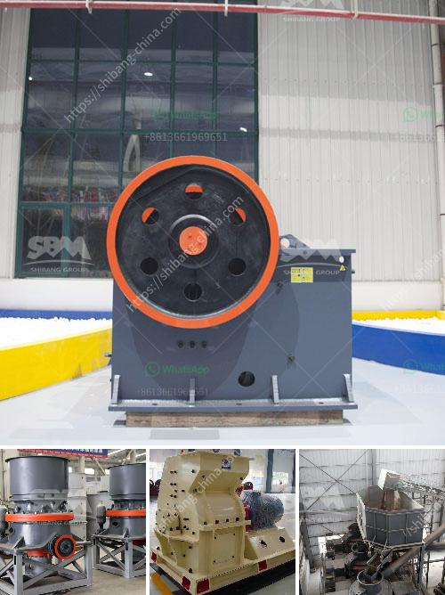

<h3>small scale gold milling and processing plant</h3>
Small-scale gold milling and processing plants are becoming increasingly popular in rural areas around the world. These plants utilize simple techniques to process gold-bearing ore, making it a profitable venture for many small-scale miners.

One such plant is the small-scale gold milling and processing plant. It is a self-contained portable unit that includes crushing and grinding units, gravity concentration units, and flotation units. This plant is specifically designed for small-scale gold recovery and can handle a capacity of up to 5 tons per hour.

The small-scale gold milling and processing plant offers miners affordable access to the gold-rich ores that surround them. Unlike large-scale mining operations that require hefty investments, these plants are easy to set up and can be operated with minimal technical skills. This makes them an ideal solution for small-scale miners looking to generate income and improve their livelihoods.

The process begins with the crushing and grinding of the gold-bearing ore. This is accomplished using a jaw crusher and a hammer mill, which reduce the ore to a fine powder. The fine powder is then mixed with water in a ball mill, creating a slurry that is pumped to a gravity concentration unit.

In the gravity concentration unit, the slurry flows over a series of riffle tables or shaking tables. These tables use gravity and vibration to separate the heavier gold particles from the lighter gangue materials. The concentrated gold is then further processed using a flotation unit, where it is separated from the remaining impurities.

The final product of the small-scale gold milling and processing plant is a gold concentrate that can be smelted into pure gold bars. This process requires minimal equipment investment and can be easily operated by small-scale miners.

With the growing demand for gold globally, small-scale gold milling and processing plants have the potential to provide sustainable livelihoods for millions of people. These plants not only offer economic benefits but also contribute to local development by providing employment opportunities and stimulating local economies.

In conclusion, small-scale gold milling and processing plants play a crucial role in empowering small-scale miners and improving their livelihoods. These plants offer affordable access to gold-rich ores, requiring little investment and technical expertise. By efficiently extracting gold from the ore, these plants contribute to sustainable development and local economic growth in rural areas.
<h3>Contact us</h3><ul><li><strong>Whatsapp:&nbsp;<a href="https://wa.me/8613661969651">+8613661969651</a></strong></li><li><a href="https://swt.shibang-china.com/?git&amp;zhl&amp;small scale gold milling and processing plant"><strong>Online Service(chat now)</strong></a></li></ul><h3>Related</h3><ul><li><a href='canber de broage ciment.md'>canber de broage ciment</a></li><li><a href='chalk manufacturing machinechalk mining machinery.md'>chalk manufacturing machinechalk mining machinery</a></li><li><a href='calcium carbonate powder crushing crusher usa.md'>calcium carbonate powder crushing crusher usa</a></li><li><a href='graphite processing equipment.md'>graphite processing equipment</a></li><li><a href='silica sand drying machine germany.md'>silica sand drying machine germany</a></li></ul>