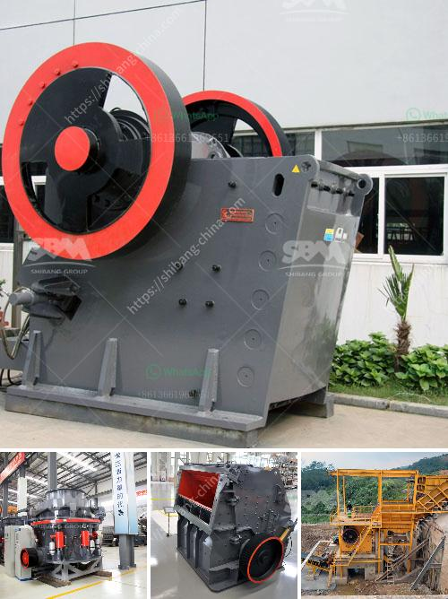

<h3>small scale mining equipment south africa price</h3>
Small-scale mining refers to the extraction of minerals or other valuable resources from small deposits and with low levels of production. It is a widespread phenomenon in developing countries, particularly in rural areas where mining activities are often the main source of income for local communities.

In South Africa, small-scale mining is widely recognized as a significant contributor to poverty alleviation, a source of employment, and a vital part of the economy. It plays a crucial role in providing livelihood opportunities, particularly for marginalized and vulnerable groups.

However, like any other mining activity, small-scale mining requires adequate equipment and machinery to ensure safe and efficient operations. The availability and affordability of such equipment have a significant impact on the success and sustainability of small-scale miners.

One of the main challenges faced by small-scale miners in South Africa is the lack of access to modern mining equipment, which hinders their ability to carry out effective and safe mining practices. Many small-scale miners resort to outdated manual methods, which are not only inefficient but also pose risks to their health and safety.

The high cost of modern mining equipment further exacerbates the situation, as small-scale miners struggle to afford the latest machinery and tools to improve their mining operations. This limits their productivity and profitability, thus perpetuating the cycle of poverty and inequality.

To address this issue, various stakeholders, including government bodies, non-profit organizations, and private sector enterprises, have been working towards increasing the availability and affordability of small-scale mining equipment in South Africa.

For instance, government initiatives have been launched to provide financial support and technical assistance to small-scale miners, enabling them to access affordable financing for the purchase of mining equipment. Additionally, partnerships between mining equipment manufacturers and local communities have facilitated the development of equipment tailored to the specific needs and constraints of small-scale miners in South Africa.

Moreover, the growing recognition of the importance of artisanal and small-scale mining has attracted international support and investments. International organizations, such as the United Nations and World Bank, have initiated programs and funding opportunities to promote sustainable mining practices and improve access to affordable and environmentally-friendly mining equipment in developing countries.

Efforts to reduce the price of small-scale mining equipment in South Africa have also been driven by the need to improve the safety and working conditions of miners. Modern equipment not only increases productivity but also minimizes the risks associated with manual labor. This is particularly important in the context of South Africa, where the mining sector has a high incidence of accidents and fatalities.

In conclusion, the availability and affordability of small-scale mining equipment in South Africa are critical factors that determine the success and sustainability of small-scale mining operations. Efforts by various stakeholders to increase access to modern equipment, reduce prices, and improve safety standards are essential for realizing the potential benefits of small-scale mining for local communities and the country's economy as a whole.
<h3>Contact us</h3><ul><li><strong>Whatsapp:&nbsp;<a href="https://wa.me/8613661969651">+8613661969651</a></strong></li><li><a href="https://swt.shibang-china.com/?git&amp;zhl&amp;small scale mining equipment south africa price"><strong>Online Service(chat now)</strong></a></li></ul><h3>Related</h3><ul><li><a href='limestone crushing equipment.md'>limestone crushing equipment</a></li><li><a href='pulverizing ball mills suppliers.md'>pulverizing ball mills suppliers</a></li><li><a href='manufacturer of vibrating screens.md'>manufacturer of vibrating screens</a></li><li><a href='china mineral ore processing mill ball.md'>china mineral ore processing mill ball</a></li><li><a href='stone grinding mill.md'>stone grinding mill</a></li></ul>