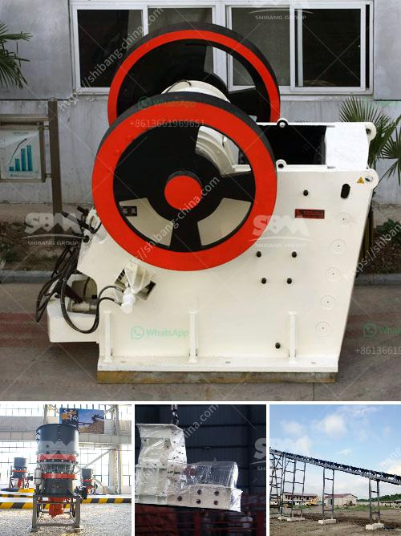

<h3>small scale mining plant philippines diagram</h3>
Small-scale mining in the Philippines has been a prominent source of livelihood for thousands of Filipinos, particularly those in remote areas. These mining operations are often carried out by individuals or small groups using rudimentary equipment and techniques.

To better understand the process of small-scale mining in the Philippines, it is essential to examine the diagram of a typical small-scale mining plant. The diagram provides a clear visual representation of the equipment and processes involved in the mining operation.

Starting with the initial stage, the diagram shows that the small-scale mining plant typically begins with the excavation of the mineral deposits. This involves manual labor or the use of small tools and equipment such as hand picks, shovels, and hammers.

Once the mineral deposits are extracted, they are transported to the processing area shown in the next stage of the diagram. Here, the extracted minerals undergo various processes to separate the valuable ore from the waste material. These processes may include crushing, grinding, and sieving, depending on the nature of the mineral being mined.

The diagram also indicates the presence of water in the processing area, which is used to wash and separate the minerals further. Water is an essential component in small-scale mining operations as it aids in the separation and concentration of valuable minerals.

Finally, the last stage of the diagram illustrates the recovery or extraction of the valuable mineral from the waste material. This can be achieved through techniques such as gravity separation or the use of chemicals to separate the valuable minerals from the waste material.

It is important to note that while small-scale mining is a significant source of livelihood for many Filipinos, it also poses environmental and health risks. Improper waste disposal, the use of harmful chemicals, and unsustainable mining practices can have detrimental effects on ecosystems and human health.

Overall, the diagram of a small-scale mining plant in the Philippines provides a glimpse into the techniques and processes involved in this industry. As the government continues to support small-scale miners, there is a need to promote sustainable mining practices that prioritize environmental protection and the well-being of the communities involved.
<h3>Contact us</h3><ul><li><strong>Whatsapp:&nbsp;<a href="https://wa.me/8613661969651">+8613661969651</a></strong></li><li><a href="https://swt.shibang-china.com/?git&amp;zhl&amp;small scale mining plant philippines diagram"><strong>Online Service(chat now)</strong></a></li></ul><h3>Related</h3><ul><li><a href='canber de broage ciment.md'>canber de broage ciment</a></li><li><a href='crusher business aggregate.md'>crusher business aggregate</a></li><li><a href='puzzolana 200 tph stage aggregate crushing.md'>puzzolana 200 tph stage aggregate crushing</a></li><li><a href='capacity 70 130tph impact crusher.md'>capacity 70 130tph impact crusher</a></li><li><a href='grinding tunbe mill and ball mill.md'>grinding tunbe mill and ball mill</a></li></ul>