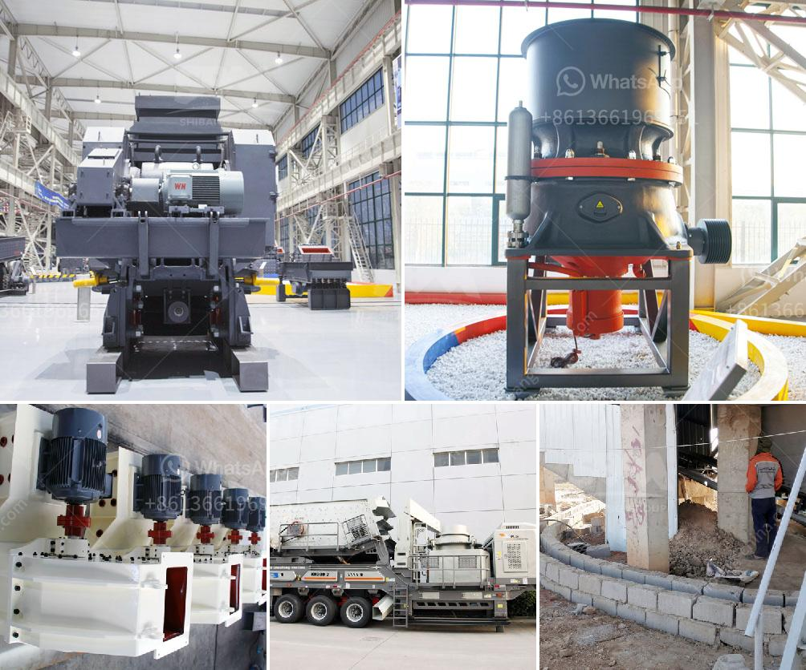

<h3>smill grinding mill machine price</h3>
When it comes to investing in a grinding mill machine, finding the right balance between price and quality is essential. The cost of a grinding mill machine can vary greatly depending on the features, specifications, and brand. However, there are affordable options available on the market that provide excellent performance without breaking the bank. One such option is a smill grinding mill machine.

Smill grinding mill machines are compact, versatile, and cost-effective solutions for both small-scale and medium-scale industries. These machines are specifically designed to grind grains, herbs, and other materials into fine powders or pastes. They are commonly used in the food processing industry, pharmaceutical industry, and even in household kitchens.

The price of a smill grinding mill machine can range from $100 to $500, depending on the brand and specifications. While this may seem relatively low compared to larger grinding mill machines, smill grinding mill machines are still capable of handling a significant quantity of materials efficiently. They are typically powered by electricity and operate at lower speeds, which reduces noise levels and enhances energy efficiency.

One of the key advantages of smill grinding mill machines is their compact size. They take up minimal space, making them ideal for small commercial spaces or home kitchens. Despite their smaller size, these machines can grind a variety of materials, including grains, spices, coffee beans, nuts, and more. Some models even have adjustable settings to achieve different levels of fineness, catering to different culinary or industrial needs.

Furthermore, smill grinding mill machines are often equipped with durable stainless-steel blades or burrs that ensure consistent and precise grinding results. The materials used in their construction are of high quality, ensuring longevity and resistance to wear and tear. These machines are also relatively easy to clean and maintain, requiring minimal effort on the part of the user.

When considering the purchase of a smill grinding mill machine, it is essential to assess individual requirements. Factors such as the desired output capacity, types of materials to be processed, and budget constraints must be taken into account. Researching different brands and comparing their features, warranties, and customer reviews can provide valuable insights into the overall value and performance of a particular machine.

In conclusion, a smill grinding mill machine offers a cost-effective and efficient solution for grinding various materials. With prices ranging from $100 to $500, these machines are suitable for small-scale and medium-scale industries, as well as individual users. Compact and versatile, they deliver consistent grinding results while taking up minimal space. Before making a purchase, it is advisable to consider specific requirements and compare different models to find the best-suited option.
<h3>Contact us</h3><ul><li><strong>Whatsapp:&nbsp;<a href="https://wa.me/8613661969651">+8613661969651</a></strong></li><li><a href="https://swt.shibang-china.com/?git&amp;zhl&amp;smill grinding mill machine price"><strong>Online Service(chat now)</strong></a></li></ul><h3>Related</h3><ul><li><a href='mini crusher hire johannesburg.md'>mini crusher hire johannesburg</a></li><li><a href='screen astec vibrating screen price.md'>screen astec vibrating screen price</a></li><li><a href='concrete crusher for rent qatar.md'>concrete crusher for rent qatar</a></li><li><a href='prices for cheap roller mills in south africa.md'>prices for cheap roller mills in south africa</a></li><li><a href='crusher primary cone crusher.md'>crusher primary cone crusher</a></li></ul>