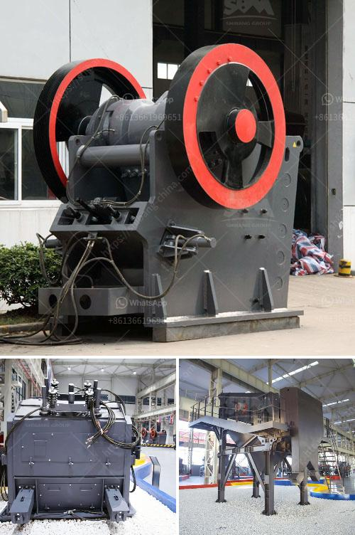

<h3>south africa gold processing equipment</h3>
South Africa has always been known for its rich reserves of gold, making it one of the leading global producers of the precious metal. Despite facing numerous challenges, including fluctuating gold prices and a declining mining sector, South Africa continues to be a powerhouse in gold production.

To extract gold from its ore, workers in South Africa rely on specialized equipment. In recent years, technological advancements have brought significant improvements to the gold processing industry, facilitating better productivity and efficiency.

One of the primary pieces of equipment used in gold processing is the gold milling machine. This machine pulverizes the gold-bearing ore into a fine powder, ensuring effective extraction. The gold milling process involves crushing the ore into a fine powder, followed by dissolving the gold particles using cyanide. This process is known as cyanidation and has been the main method of gold extraction for over a century.

In addition to milling machines, South Africa also utilizes gold centrifugal concentrators. These machines use centrifugal force to separate gold particles from other minerals in the ore. The ore is fed into a rotating drum, where the centrifugal force causes the heavier gold particles to be pushed to the outer edge of the drum, while lighter particles are discharged at the center. This process allows for efficient recovery of gold, even from low-grade ores.

Another crucial piece of equipment in the gold processing industry is the gold smelting furnace. After the gold has been extracted from the ore, it needs to be refined and purified. Smelting involves melting the gold in a furnace at high temperatures, separating impurities and producing pure gold. The molten gold is then cast into ingots or bars, ready for market distribution.

One of the challenges faced by the gold processing industry in South Africa is the increasing need for eco-friendly and sustainable practices. In recent years, there has been a growing focus on reducing the environmental impact of gold processing. Efforts have been made to minimize the use of harmful chemicals, such as cyanide, by exploring alternative extraction methods. Additionally, advancements in technology have led to the development of energy-efficient equipment, helping to reduce the carbon footprint of the gold processing industry.

Despite the challenges faced, South Africa remains a prominent player in the gold processing and mining sector. The country's vast reserves of gold, coupled with technological advancements in equipment, ensure its continued success in gold extraction and production. Furthermore, the industry's commitment to sustainability and eco-friendly practices promises a brighter future for gold processing in South Africa.

In conclusion, South Africa's gold processing equipment plays a crucial role in the country's gold mining industry. The gold milling machine, centrifugal concentrators, and smelting furnaces are vital pieces of equipment that contribute to efficient, eco-friendly, and sustainable gold extraction. With ongoing advancements and a commitment to sustainability, South Africa is well-positioned to continue its legacy as a leading global producer of gold.
<h3>Contact us</h3><ul><li><strong>Whatsapp:&nbsp;<a href="https://wa.me/8613661969651">+8613661969651</a></strong></li><li><a href="https://swt.shibang-china.com/?git&amp;zhl&amp;south africa gold processing equipment"><strong>Online Service(chat now)</strong></a></li></ul><h3>Related</h3><ul><li><a href='stone quarries south africa.md'>stone quarries south africa</a></li><li><a href='hammer mill for silica stone.md'>hammer mill for silica stone</a></li><li><a href='hammer mill production location in nigeria.md'>hammer mill production location in nigeria</a></li><li><a href='fine powder mill.md'>fine powder mill</a></li><li><a href='capacity 70 130tph impact crusher.md'>capacity 70 130tph impact crusher</a></li></ul>