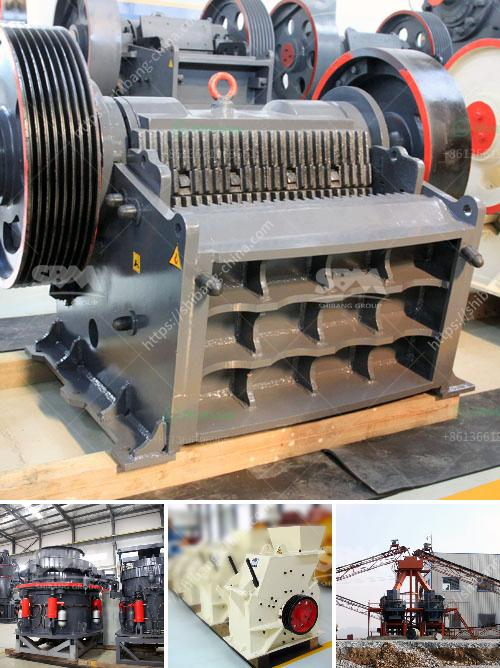

<h3>speed in rollal mill</h3>
Rolling mills are essential machinery in the metalworking industry, allowing for the shaping and refining of various materials. One key aspect that greatly impacts the efficiency and productivity of these mills is the speed at which they operate. The speed at which a rolling mill functions has significant implications on the quality of output, energy consumption, and overall productivity.

Speed is a fundamental factor that determines the metallurgical properties and final dimensions of rolled products. Higher speeds in rolling mills result in increased plastic deformation of the material, leading to further reduction in the size of the final product. Conversely, slower speeds help maintain precise dimensions and control over the material properties. This makes the speed of a rolling mill a critical parameter that needs careful consideration.

Another important aspect impacted by speed is energy consumption. A higher rolling speed often requires more energy input in order to overcome the increased resistance and friction during the rolling process. This increased energy consumption can have a significant impact on the overall operational costs of a rolling mill. Therefore, finding the optimal speed that balances energy efficiency with productivity is crucial for rolling mill operators.

The speed at which a rolling mill operates also influences the productivity of the entire metalworking operation. A higher rolling speed can increase the throughput of the mill, enabling more material to be rolled within a given time frame. This can lead to increased production capacity and improved efficiency. However, it is important to consider the limitations and capabilities of the mill equipment, as operating at extremely high speeds can also decrease the overall process stability and increase the risk of errors or defects.

In conclusion, the speed at which a rolling mill operates is a critical factor that affects the quality, energy consumption, and productivity of the mill. Finding the optimal speed requires careful consideration of several factors, such as the desired final dimensions, material properties, energy efficiency, and equipment capabilities. By carefully adjusting and optimizing the speed, rolling mill operators can maximize production capacity while maintaining high-quality output and energy efficiency.
<h3>Contact us</h3><ul><li><strong>Whatsapp:&nbsp;<a href="https://wa.me/8613661969651">+8613661969651</a></strong></li><li><a href="https://swt.shibang-china.com/?git&amp;zhl&amp;speed in rollal mill"><strong>Online Service(chat now)</strong></a></li></ul><h3>Related</h3><ul><li><a href='stone crusher maker in india.md'>stone crusher maker in india</a></li><li><a href='track mounted crushers.md'>track mounted crushers</a></li><li><a href='vibrating wire screen suppliers.md'>vibrating wire screen suppliers</a></li><li><a href='copper ore complete concentrating method.md'>copper ore complete concentrating method</a></li><li><a href='works cement grinding ball mill.md'>works cement grinding ball mill</a></li></ul>