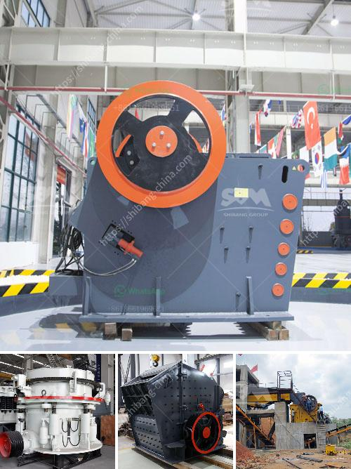

<h3>sri lankan building sand price</h3>
The price of building sand in Sri Lanka has seen fluctuation in recent years due to various factors including supply and demand dynamics, environmental concerns, and government regulations. Building sand, commonly used in construction activities such as making mortar and concrete, is an essential component in the development of infrastructure and buildings in the country.

One of the main factors affecting the price of building sand is the high demand for construction projects. Sri Lanka has been experiencing rapid urbanization and infrastructure development, leading to a surge in the need for building materials, including sand. As a result, the demand for building sand has been consistently high, driving up prices in the market.

Furthermore, the scarcity of suitable sand sources in certain regions contributes to the rising prices. The extraction of sand from rivers and beaches can have detrimental environmental effects, leading to erosion, loss of biodiversity, and disruption of ecosystems. To mitigate these impacts, the Sri Lankan government has implemented regulations in the past, restricting the extraction of sand from certain areas. This has limited the supply of sand in the market, resulting in higher prices.

Additionally, transportation costs play a role in determining the final price of building sand. Sri Lanka's geography, with its scattered sources of sand and varying distance from construction sites, adds to the logistical challenges of transporting the material. These transportation costs are factored into the price, further contributing to the overall increase.

To combat rising prices and meet the increasing demand for building sand, the Sri Lankan government has been promoting alternatives such as manufactured sand or crusher dust. These substitutes can help reduce the reliance on natural sand sources and provide a more sustainable solution. However, their adoption in the construction industry is still limited due to the traditional preference for natural sand.

In conclusion, the price of building sand in Sri Lanka is subject to various factors such as supply and demand dynamics, environmental concerns, and transportation costs. As the country continues to develop its infrastructure and face increasing urbanization, it is essential to find sustainable alternatives to ensure the availability and affordability of building sand in the long term.
<h3>Contact us</h3><ul><li><strong>Whatsapp:&nbsp;<a href="https://wa.me/8613661969651">+8613661969651</a></strong></li><li><a href="https://swt.shibang-china.com/?git&amp;zhl&amp;sri lankan building sand price"><strong>Online Service(chat now)</strong></a></li></ul><h3>Related</h3><ul><li><a href='vibratory screen south africa.md'>vibratory screen south africa</a></li><li><a href='50tph stone crusher in germany for sale.md'>50tph stone crusher in germany for sale</a></li><li><a href='ouedkniss station concassage.md'>ouedkniss station concassage</a></li><li><a href='sand making production line.md'>sand making production line</a></li><li><a href='process of roll milling.md'>process of roll milling</a></li></ul>