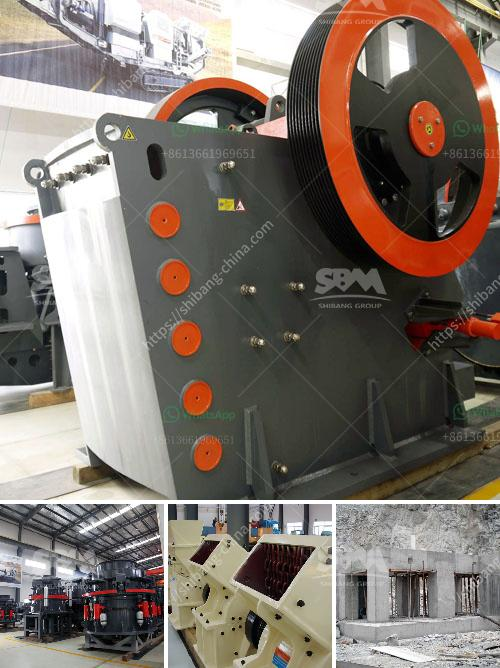

<h3>start a stone crusher</h3>
Starting a stone crusher is no easy task, although it seems like a relatively simple job. In order to get started with the business, you will need to acquire a business license, obtain necessary permits, ensure compliance with environmental regulations, and secure a proper location. Additionally, you will need machinery, such as a crusher, that will allow you to break down the larger rocks into smaller and more manageable sizes.

The first step in starting a stone crusher is obtaining the necessary equipment, which includes a dump truck to transport the stone, a forklift for lifting and loading the stone, and a tractor for hauling the crushed stone. The second step is to design a layout plan and undertake a site inspection. This will help you determine the kind of material you need to crush and the amount of space required to accommodate the machinery. Once you have obtained all the necessary permits and licenses, the third step is to secure a location for your stone crushing business. This will require purchasing land or leasing a site.

Lastly, you will need to establish a budget for financing your venture and determine how you will finance it. Many aspiring entrepreneurs may seek loans or investment from friends or family members. Alternatively, you can also explore government funding or grants available for small businesses.

Starting a stone crusher is a lengthy process that requires patience and perseverance. However, if you take the necessary steps and consider all the factors mentioned above, you will ultimately find success. So, ensure you follow the necessary steps to embark on your stone crusher business venture.
<h3>Contact us</h3><ul><li><strong>Whatsapp:&nbsp;<a href="https://wa.me/8613661969651">+8613661969651</a></strong></li><li><a href="https://swt.shibang-china.com/?git&amp;zhl&amp;start a stone crusher"><strong>Online Service(chat now)</strong></a></li></ul><h3>Related</h3><ul><li><a href='alluvial gold washing machine manufacturer.md'>alluvial gold washing machine manufacturer</a></li><li><a href='find fine jaw crusher in china.md'>find fine jaw crusher in china</a></li><li><a href='coal processing equipment.md'>coal processing equipment</a></li><li><a href='aggregate crusher production.md'>aggregate crusher production</a></li><li><a href='basalt crusher supplier.md'>basalt crusher supplier</a></li></ul>