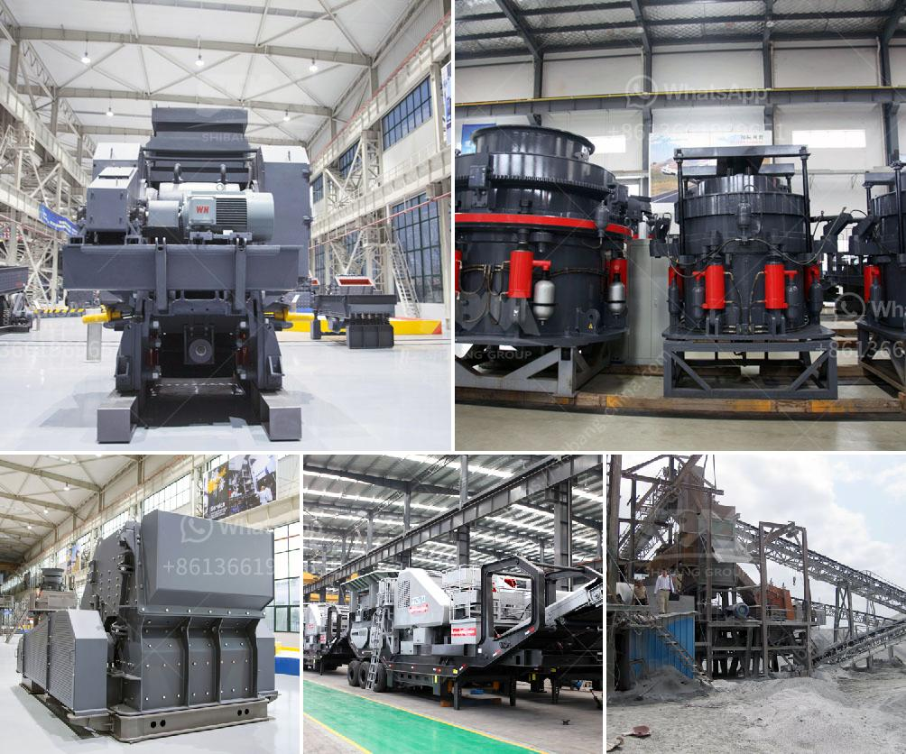

<h3>station de concasassage theniet elhad</h3>
In the realm of construction, the importance of reliable infrastructure cannot be stressed enough. For efficient building processes, high-quality construction materials are a necessity. This is where Station de Concasassage Theniet Elhad steps in, contributing significantly to the construction industry in Algeria.

Located in Theniet Elhad, a region known for its abundance of construction materials, this station plays a crucial role in supplying essential resources to various construction projects in the country. Station de Concasassage Theniet Elhad specializes in the crushing and sieving of rocks, providing high-quality aggregates that are essential for the production of concrete, asphalt, and other construction materials.

The station boasts state-of-the-art machinery and equipment, ensuring the efficient processing of raw materials. Through advanced crushing and sieving techniques, the rocks are transformed into uniform and graded aggregates. These aggregates are carefully selected to meet the specific requirements of different construction projects. Whether it is for roadworks, building foundations, or infrastructure development, the station provides tailor-made materials suitable for each application.

One of the key advantages of Station de Concasassage Theniet Elhad is its commitment to sustainability. The station follows environmentally friendly practices throughout its operations. By implementing proper dust control measures and wastewater treatment systems, it minimizes the environmental impact of its activities. This dedication to preserving the natural surroundings is commendable, as it allows for the sustainable use of the area's resources.

Furthermore, the station prioritizes safety in its operations. It strictly adheres to health and safety regulations to ensure the well-being of its employees and visitors. Routine maintenance and inspection of machinery are carried out regularly to prevent accidents and ensure optimal performance, thus maintaining a safe working environment.

Station de Concasassage Theniet Elhad has emerged as a reliable partner for the construction industry in Algeria. With its commitment to producing high-quality aggregates, implementing sustainable practices, and maintaining the highest safety standards, the station sets a benchmark in the field. Its contribution to the construction sector cannot be underestimated, as it plays a vital role in the development and growth of infrastructure across the nation.

In conclusion, the Station de Concasassage Theniet Elhad stands as a shining example of how an efficient and responsible construction material supplier can revolutionize the industry. Through its advanced technology, sustainable practices, and unwavering commitment to safety, it is a driving force behind the success of countless construction projects in Algeria. As the demand for reliable infrastructure continues to grow, the station's dedication to excellence ensures that it remains at the forefront of the industry for years to come.
<h3>Contact us</h3><ul><li><strong>Whatsapp:&nbsp;<a href="https://wa.me/8613661969651">+8613661969651</a></strong></li><li><a href="https://swt.shibang-china.com/?git&amp;zhl&amp;station de concasassage theniet elhad"><strong>Online Service(chat now)</strong></a></li></ul><h3>Related</h3><ul><li><a href='crusher manufacturer in.md'>crusher manufacturer in</a></li><li><a href='jaw crusher private sale south africa.md'>jaw crusher private sale south africa</a></li><li><a href='sand dust removal.md'>sand dust removal</a></li><li><a href='used stone crushing equipment in assam.md'>used stone crushing equipment in assam</a></li><li><a href='china hammer mill.md'>china hammer mill</a></li></ul>