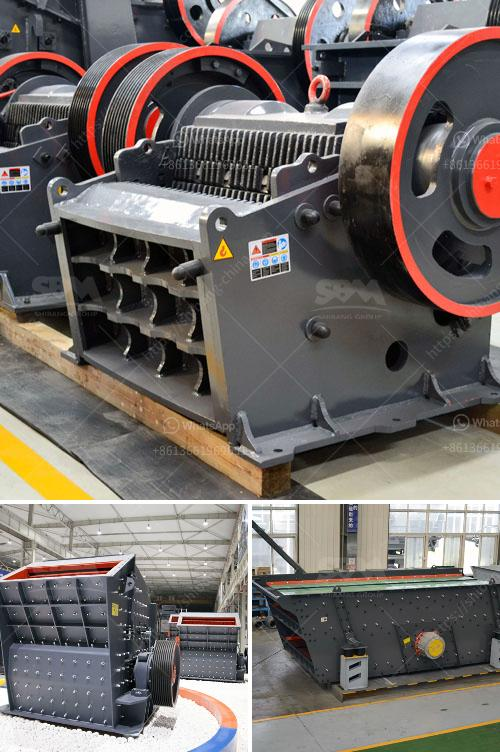

<h3>stone crushar plant price list stone</h3>
Stone crusher plant is a labor-intensive process. Followed by that, the cost to set up a stone crusher plant in India is also quite significant. Factors such as the size of the site, the number of required stones, the expected processing capacity of the crusher factory, the desired output price of the crushed stone, the input cost of equipment, the location and layout of the crusher factory, all are important aspects to consider when determining the stone crusher plant price list.

The cost of a stone crusher plant can vary depending on a variety of factors. One of the most important factors is already mentioned – the expected processing capacity. Different capacity models apply to different requirements. For example, a small-capacity plant may be suitable for a small construction site, while a larger-capacity plant is required for large-scale projects. It is important to have a clear understanding of your requirements and expectations before making a purchasing decision.

Another factor that determines the stone crusher plant price list is the quality and robustness of the equipment. A high-quality and robust machine will have a longer lifespan and require less maintenance and repairs in the long run. Investing in a low-quality machine may result in frequent breakdowns and repairs, increasing the overall cost of the plant.

The location and layout of the crusher plant should also be considered. If the plant is situated in a remote area, the transportation costs of raw materials and aggregate may be higher, thus increasing the overall cost. In addition, the layout of the plant should be optimized for efficient material flow, minimizing the production time and maximizing the output. A well-designed layout can greatly improve the productivity and efficiency of the plant, resulting in cost savings.

Finally, the stone crusher plant price list should also take into account the expected output price of the crushed stone. Different types of stone have different market values, and the price of the crushed stone will also vary accordingly. It is important to have a clear understanding of the demand and market prices of the crushed stone in your area before setting the output price. This will help you estimate the potential revenue and profits from the plant, enabling you to make an informed decision.

In conclusion, the stone crusher plant price list is determined by various factors such as the expected processing capacity, quality of equipment, location, layout, and output price of the crushed stone. Considering these factors and conducting thorough market research will help you make a wise investment decision. It is important to prioritize the long-term benefits and potential profitability of the plant rather than solely focusing on the initial price. A well-functioning and efficient stone crusher plant can be a valuable asset for any construction project.
<h3>Contact us</h3><ul><li><strong>Whatsapp:&nbsp;<a href="https://wa.me/8613661969651">+8613661969651</a></strong></li><li><a href="https://swt.shibang-china.com/?git&amp;zhl&amp;stone crushar plant price list stone"><strong>Online Service(chat now)</strong></a></li></ul><h3>Related</h3><ul><li><a href='vibrating wire screen suppliers.md'>vibrating wire screen suppliers</a></li><li><a href='concrete crusher cost.md'>concrete crusher cost</a></li><li><a href='sand processing plant for sale.md'>sand processing plant for sale</a></li><li><a href='bhel coal mill spares manufacturers.md'>bhel coal mill spares manufacturers</a></li><li><a href='portable concrete crusher for rent qatar.md'>portable concrete crusher for rent qatar</a></li></ul>