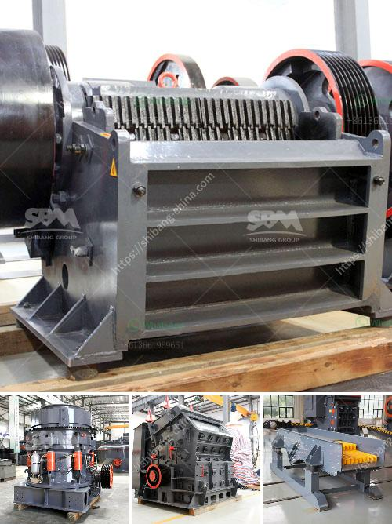

<h3>stone crusher baler</h3>
Waste management is becoming an increasingly pressing issue around the world. With rapid urbanization and industrialization, the amount of waste generated is skyrocketing, leading to environmental pollution and health hazards. Therefore, finding innovative solutions for waste management is crucial for sustainable development.

One such solution is the stone crusher baler, a machine that provides efficient waste disposal by crushing large stones into small pieces. This ingenious device not only helps reduce waste volume but also enables recycling, making it a win-win solution for both the environment and the economy.

The stone crusher baler is a heavy-duty machine specifically designed to crush large stones into small pieces for disposal or recycling purposes. This innovative machine has a compact and robust design that ensures easy transportation and storage. With its powerful hydraulic mechanism and sharp blades, the stone crusher baler can easily crush stones of various sizes, saving time and effort in waste management.

One of the key advantages of using a stone crusher baler is that it reduces waste volume significantly. By crushing large stones into small pieces, the baler helps optimize the available space for waste storage. This is especially important in areas with limited land resources, where efficient waste management is paramount.

Additionally, the stone crusher baler enables recycling. After the stones are crushed, they can be used for various purposes, such as construction materials or landscaping. This not only reduces the need for extracting new materials but also contributes to the circular economy by reusing existing resources.

Moreover, the stone crusher baler is an eco-friendly solution for waste management. By reducing waste volume and promoting recycling, it helps minimize the environmental impact of waste disposal. This is particularly beneficial in reducing air and water pollution, as well as conserving natural resources.

Furthermore, the stone crusher baler offers numerous economic advantages. Firstly, it saves money in waste management costs by reducing the frequency of waste collection and disposal. Additionally, the crushed stones can be sold as construction materials, generating a revenue stream for waste management operations.

Another notable advantage of the stone crusher baler is its versatility. It can be used in a wide range of applications, including construction sites, demolition projects, land reclamation, and even agriculture. Its adaptability makes it a valuable asset for waste management in various industries.

In conclusion, the stone crusher baler is a unique solution for waste management. With its ability to crush large stones into small pieces, it optimizes waste volume and enables recycling. This eco-friendly machine not only reduces the environmental impact of waste disposal but also offers economic benefits. Its versatility makes it suitable for various industries, ensuring efficient waste management in different contexts. As the world grapples with the mounting waste problem, the stone crusher baler provides a much-needed solution for sustainable development.
<h3>Contact us</h3><ul><li><strong>Whatsapp:&nbsp;<a href="https://wa.me/8613661969651">+8613661969651</a></strong></li><li><a href="https://swt.shibang-china.com/?git&amp;zhl&amp;stone crusher baler"><strong>Online Service(chat now)</strong></a></li></ul><h3>Related</h3><ul><li><a href='concrete jaw crusher.md'>concrete jaw crusher</a></li><li><a href='stone crusher plant ton jam.md'>stone crusher plant ton jam</a></li><li><a href='quick lime powder machine.md'>quick lime powder machine</a></li><li><a href='stone crushing company in philippines.md'>stone crushing company in philippines</a></li><li><a href='gold corporation ball mill.md'>gold corporation ball mill</a></li></ul>