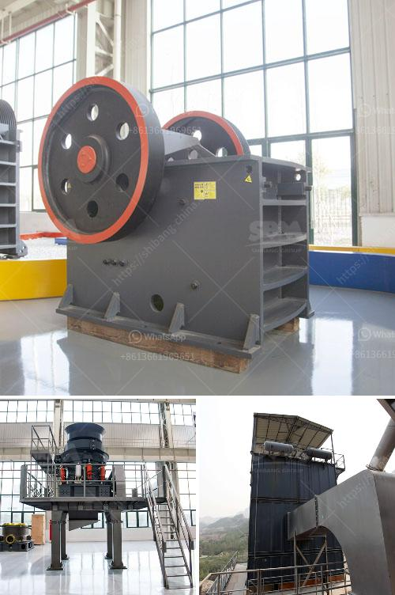

<h3>stone crusher capacity</h3>
Stone crusher is essential equipment in mining machinery, common stone crusher mainly include jaw crusher, mobile crushing station, counter-attack crusher, impact crusher, compound crusher, hammer crusher, vertical crusher, etc. 

Stone crusher is suitable for crushing all kinds of medium and above medium hardness materials. Different stone crusher types have different feeding sizes, production capacities and outputs. The output size of the stone crusher also determines the processing capacity of the production line. Stone crusher with different output size is suitable for different processing projects.

The production capacity of stone crusher refers to the amount of crushed stone produced in an hour. The production capacity of a stone crusher depends on the size of the feed port, the particle size of the crushed material, the discharge port, the motor power and the processing capacity of the auxiliary equipment of the crusher. 

The stone crusher requires a certain floor area and clearance around the equipment. With the increase of product spec from the original requirement of users, the product capacity of the stone crusher is gradually increasing. Many customers want to increase their production capacity while using the same specifications of machines. The rational use of equipment can also reduce downtime and improve efficiency to a certain extent. 

In general, the larger the production capacity of the stone crusher, the higher the output and the higher the investment cost. In addition to the equipment itself, the factors affecting the crushing capacity include the nature of the material, the size and hardness of the feed, the feed size, the product requirements, the operation efficiency, and the feeding mode. These factors should be considered comprehensively in order to improve the production capacity of the stone crusher.

To improve the crushing capacity, it is necessary to choose the right type of stone crusher according to the characteristics of the material. The primary crushing stage is usually carried out by a jaw crusher, followed by a secondary crushing stage with a cone crusher. If the materials are very hard or abrasive, a third crushing stage with an impact crusher can be used. 

In addition, the shape and size of the feed material can also affect the production capacity. If the feed material contains more fine particles, it will reduce the production capacity of the stone crusher because the fine particles tend to clog the crushing cavity of the stone crusher and increase the wear of the equipment. Therefore, it is important to control the particle size and shape of the feed material.

In conclusion, the stone crusher capacity is determined by various factors, such as the type and specifications of the equipment, the nature of the material, and the size and shape of the feed material. To improve the production capacity of the stone crusher, it is important to choose the right type of stone crusher, optimize the design of the equipment, control the feed particle size and shape, and provide regular maintenance and repair. By doing so, the stone crusher can work efficiently and achieve the desired production capacity.
<h3>Contact us</h3><ul><li><strong>Whatsapp:&nbsp;<a href="https://wa.me/8613661969651">+8613661969651</a></strong></li><li><a href="https://swt.shibang-china.com/?git&amp;zhl&amp;stone crusher capacity"><strong>Online Service(chat now)</strong></a></li></ul><h3>Related</h3><ul><li><a href='concrete crusher hire price in south africa.md'>concrete crusher hire price in south africa</a></li><li><a href='ball mill feed spout sale.md'>ball mill feed spout sale</a></li><li><a href='gypsum router machines in uae.md'>gypsum router machines in uae</a></li><li><a href='quarry equipment and crushers companies in japan.md'>quarry equipment and crushers companies in japan</a></li><li><a href='marble powder micronizer plant in china.md'>marble powder micronizer plant in china</a></li></ul>