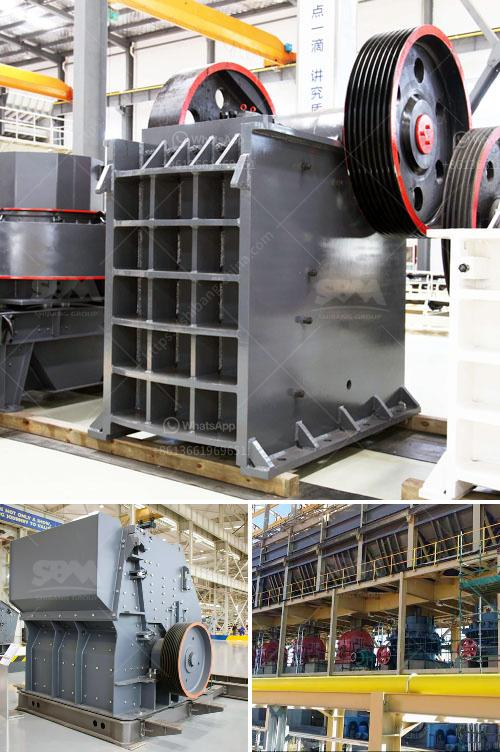

<h3>stone crusher for hire south africa</h3>
Stone crusher is an integral part of mining industry in South Africa. It is well suited for mining and quarrying applications, especially for road construction, building, metallurgical industry, and so forth. Many types of stone crusher machine are available for stone crushing industry. When choosing stone crusher plant, there are many factors to be considered, such as production requirements, capital cost, ore characteristic etc.

Of these factors, ore characteristic is particularly important. It can determine which type of stone crusher to use, such as jaw crusher, impact crusher, cone crusher and so on. When considering the different types of stone crushers, a primary factor to consider is whether the desired final product is crushed or screened. Choosing the right stone crusher is critical in selecting the right equipment for your crushing operation.

The major equipment in a primary crushing circuit usually includes only a crusher, vibrating feeder and belt conveyor. Secondary and tertiary crushing circuits have the same basic equipment items, along with screens and surge storage bins. Additional equipment may include dust extraction systems, integrated into the plant to allow the operator to operate with the minimum of dust pollution.

Stone crushing plant for hire in South Africa is manufactured from Shanghai Xuanshi,It is the main mineral processing solutions. Doubleroller crusher and finalAsh Crusher Roller South Africa terramachines. Stone Crusher For Sale In South Africa Gold Ore. stone crusher is the main used mining equipment in south africa mineral industry. gold ore crushing plant machine will help to process the raw gold ore into high economic value products. south africa general introduction south africa is africas first largest economy country, and the national has a high standard of living in the whole.
<h3>Contact us</h3><ul><li><strong>Whatsapp:&nbsp;<a href="https://wa.me/8613661969651">+8613661969651</a></strong></li><li><a href="https://swt.shibang-china.com/?git&amp;zhl&amp;stone crusher for hire south africa"><strong>Online Service(chat now)</strong></a></li></ul><h3>Related</h3><ul><li><a href='products scm ultrafine mill.md'>products scm ultrafine mill</a></li><li><a href='mining machinery companies in germany.md'>mining machinery companies in germany</a></li><li><a href='cement clinker manufacturing machine.md'>cement clinker manufacturing machine</a></li><li><a href='used rock crushers for sale philippines.md'>used rock crushers for sale philippines</a></li><li><a href='mineria de basalto o extraccion de basalto.md'>mineria de basalto o extraccion de basalto</a></li></ul>