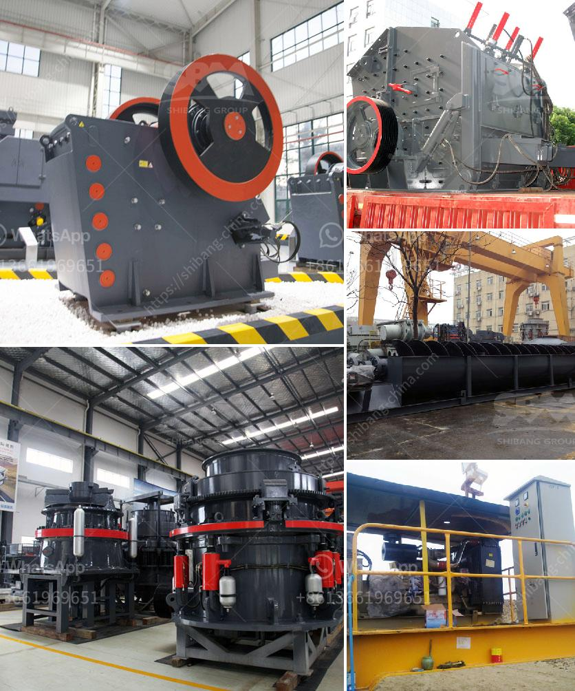

<h3>stone crusher for sale in south philippines</h3>
Stone crusher is the main equipment in the mining industry. Stone crusher for sale in South Philippines is widely used for crushing various materials like stone, granite, trap rock, coke, coal, manganese ore, iron ore, emery, fused aluminum, oxide, fused calcium carbide, lime stone, quartzite, alloys, etc.

Stone crushers are also used in construction, road building, and cement production industries. They have the ability to break down hard materials, such as rock, into smaller, more manageable pieces. In addition, they can be used to produce different sizes of crushed stone for various uses.

There are several types of stone crushers available for sale in the market. Some popular models include jaw crushers, cone crushers, impact crushers, VSI crushers, and hammer crushers. Each type of crusher has its own unique features and benefits.

Jaw crushers are commonly used in primary crushing stages and are ideal for processing hard materials. They have a high crushing ratio and a large feed opening, which allows for efficient crushing. Jaw crushers are also known for their reliability and high productivity.

Cone crushers are commonly used in secondary and tertiary crushing stages. They have a narrow discharge opening and are capable of producing high-quality particles. Cone crushers are versatile and can be used for various applications, including quarrying, mining, and recycling.

Impact crushers are designed for crushing soft and medium-hard materials. They have a high reduction ratio and can produce cubic-shaped end products. Impact crushers are commonly used in construction and demolition projects.

VSI crushers, also known as vertical shaft impact crushers, are mainly used for shaping and making artificial sand. They have a unique rock-on-rock crushing action, which produces high-quality and consistent end products. VSI crushers are ideal for the production of manufactured sand.

Hammer crushers are used for crushing materials with the maximum compressive strength of 320 MPa. They are suitable for crushing various brittle materials, such as limestone, coal, salt, gypsum, brick, concrete, and so on. Hammer crushers are widely used in the mining, cement, coal, metallurgy, building material, highway, and other industries.

In conclusion, stone crusher for sale in South Philippines is essential equipment in mining industry, which demonstrates excellent performance and has a long life span. Unlike traditional crushers, the stone crusher for sale in South Philippines uses an innovative hydraulic system, which means that the machine can be adjusted to different material conditions and capacities. This versatility makes it suitable for a wide range of applications. Whether you need a primary, secondary, or tertiary crusher, there is a stone crusher for sale in South Philippines that meets your specific needs. With so many options available, it is important to choose a reliable and reputable supplier who can provide high-quality equipment and excellent service.
<h3>Contact us</h3><ul><li><strong>Whatsapp:&nbsp;<a href="https://wa.me/8613661969651">+8613661969651</a></strong></li><li><a href="https://swt.shibang-china.com/?git&amp;zhl&amp;stone crusher for sale in south philippines"><strong>Online Service(chat now)</strong></a></li></ul><h3>Related</h3><ul><li><a href='quarries rock crushing process.md'>quarries rock crushing process</a></li><li><a href='limestone ball mill in egypt.md'>limestone ball mill in egypt</a></li><li><a href='100 tph stone crushers with vsi in india.md'>100 tph stone crushers with vsi in india</a></li><li><a href='rock crusher mill.md'>rock crusher mill</a></li><li><a href='hydro sizing silica sand crusher plant.md'>hydro sizing silica sand crusher plant</a></li></ul>