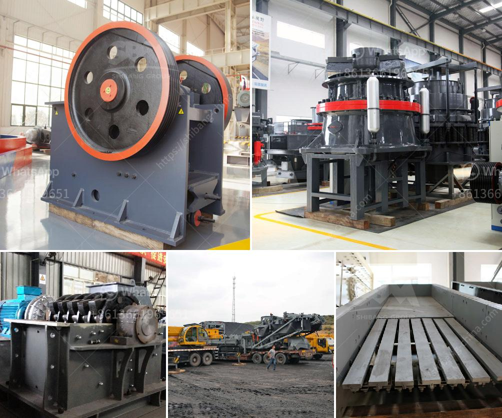

<h3>stone crusher guptas</h3>
The Gupta dynasty, which ruled over India from the 4th to 6th centuries, is considered the golden age of classical Indian civilization. The Gupta rulers were not only great patrons of the arts and learning but also made significant contributions to architecture and technology. One such technological innovation attributed to the Guptas is the stone crusher.

Stone crushers are machines that break down large stones into smaller pieces for use in a variety of construction projects. The humble beginnings of the stone crusher date back to the Gupta era where it was used primarily for road construction and maintenance. The stone crusher was a revolutionary concept that could easily cut through rocks and pave the way for smoother roads.

These stone crushers were hand-operated and required a lot of physical strength to carry out their work. It was a labor-intensive task as workers had to manually feed the stones into the crusher, turn the handle to crush them, and then collect the crushed stones for further use. However, the invention of the stone crusher greatly reduced the time and effort required for road construction.

The stone crusher guptas played a crucial role in the development and expansion of Gupta architecture. The sturdy stone crushers were used to crush and shape the stones that were used in the construction of magnificent temples, palaces, and other architectural marvels. The Guptas were known for their grand architectural projects, and the stone crusher enabled them to easily obtain the necessary building materials.

The legacy of the stone crusher guptas can still be seen in the numerous Gupta-era structures that have survived to this day. These magnificent structures stand as a testament to the engineering prowess of the Guptas and the importance of the stone crusher in their architectural endeavors.

In conclusion, the stone crusher guptas were instrumental in revolutionizing road construction and shaping the architectural landscape of ancient India. The invention of the stone crusher significantly reduced the effort and time required for construction projects. The Guptas' mastery over technology and their patronage of the arts and architecture contributed greatly to their golden age.
<h3>Contact us</h3><ul><li><strong>Whatsapp:&nbsp;<a href="https://wa.me/8613661969651">+8613661969651</a></strong></li><li><a href="https://swt.shibang-china.com/?git&amp;zhl&amp;stone crusher guptas"><strong>Online Service(chat now)</strong></a></li></ul><h3>Related</h3><ul><li><a href='100tph rock plant used for sale.md'>100tph rock plant used for sale</a></li><li><a href='rotary kiln design calculation pdf.md'>rotary kiln design calculation pdf</a></li><li><a href='grinding tunbe mill and ball mill.md'>grinding tunbe mill and ball mill</a></li><li><a href='stone crushers for sale in kenya.md'>stone crushers for sale in kenya</a></li><li><a href='new hammer mill pricing.md'>new hammer mill pricing</a></li></ul>