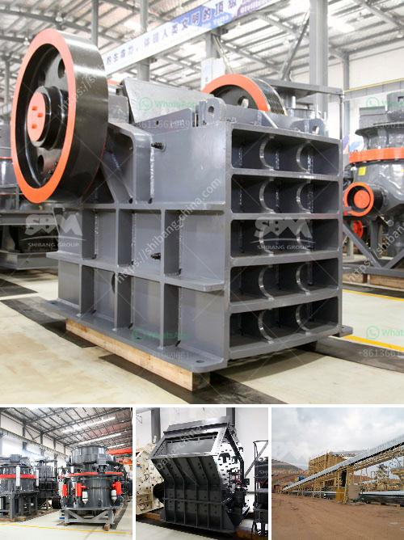

<h3>stone crusher hammer crusher</h3>
A stone crusher is a machine used to convert large stones into smaller sizes that can be used in construction or other purposes. There are several types of stone crushing machines, including jaw crusher, cone crusher, and hammer crusher. Hammer crusher is widely used for crushing limestone, coal cinder, coal, and other brittle materials below medium hardness. It has the advantages of large crushing ratio, high production capacity, uniform particle size, etc.

The stone crusher hammer crusher is suitable for mid-hard and light erosive materials whose pressure resistance strength is no more than 150Mpa and humidity lower than 15%, such as coal, salt, chalk, gypsum, blocks, limestone, etc. The hammer crusher is mainly used in such industries as cement, coal separation, electricity generation, building materials, and compound fertilizer, etc.

The hammer crusher can crush materials with different sizes into equal particle size, which allows for the convenience of turning materials into small, uniform pieces. This not only saves time but also allows for easy transportation and storage of materials. The hammer crusher has a high production capacity and can be used for crushing large quantities of materials at the same time, making it an efficient and economical choice.

In conclusion, a stone crusher hammer crusher is a useful and versatile machine that can crush and transform large stones into smaller sizes for various construction or industrial purposes. Its versatility, high production capacity, and ease of use make it a popular choice among contractors and craftsmen. Whether you need to crush limestone, coal, or any other brittle material, the stone crusher hammer crusher remains a reliable and efficient option.
<h3>Contact us</h3><ul><li><strong>Whatsapp:&nbsp;<a href="https://wa.me/8613661969651">+8613661969651</a></strong></li><li><a href="https://swt.shibang-china.com/?git&amp;zhl&amp;stone crusher hammer crusher"><strong>Online Service(chat now)</strong></a></li></ul><h3>Related</h3><ul><li><a href='puzzolana 200 tph stage aggregate crushing.md'>puzzolana 200 tph stage aggregate crushing</a></li><li><a href='south africa gold processing equipment.md'>south africa gold processing equipment</a></li><li><a href='coal pulverizer machine.md'>coal pulverizer machine</a></li><li><a href='impact crushers saudi.md'>impact crushers saudi</a></li><li><a href='crushing milling machine for graphite powder.md'>crushing milling machine for graphite powder</a></li></ul>