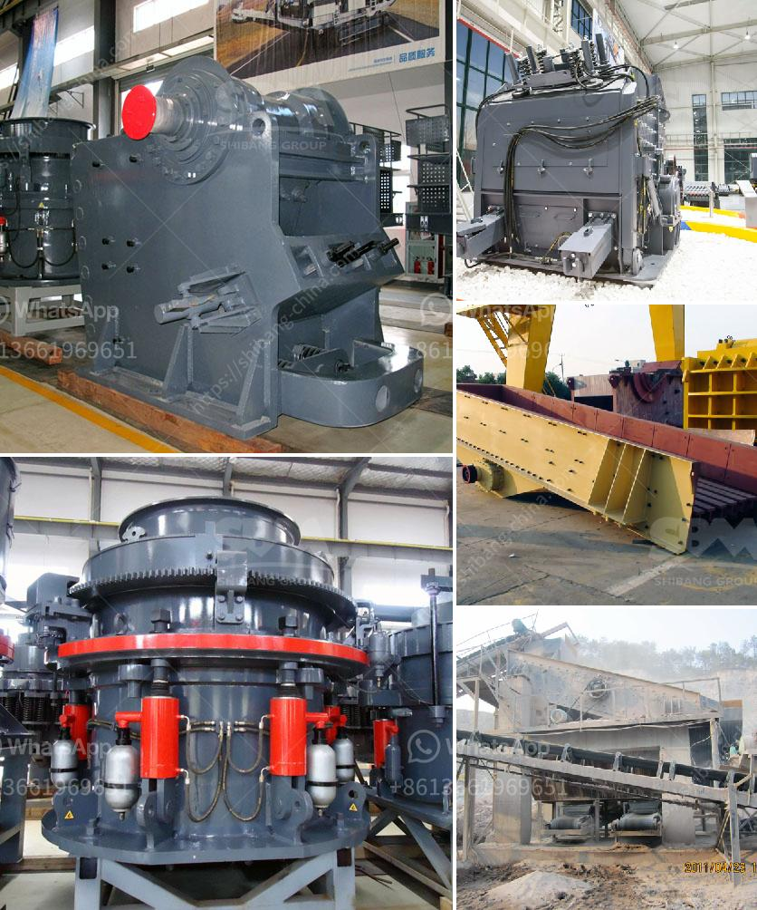

<h3>stone crusher in nairobi for sale</h3>
Stone crusher is a machine designed to reduce large rocks into smaller rocks, gravel, or rock dust. Crushers may be used to reduce the size, or change the form, of waste materials so they can be more easily disposed of or recycled, or to reduce the size of a solid mix of raw materials (as in rock ore), so that pieces of different composition can be differentiated.

In Nairobi, the stone crusher machine is widely used in local material crushing. This machine is mainly used to crush various types of stone into smaller particle size. The crushed stone typically has a particle size of 0-40mm. With the popularity of construction industry, stone crusher machines have been developed very well in Nairobi.

In stone crushing operation, the feeder or screens separate large boulders from finer rocks that do not require primary crushing, thus reducing the load to the primary crusher. The stone that is too large to pass through the top deck of the scalping screen is processed in the secondary crusher. Cone crushers are commonly used for secondary crushing, which typically reduces material to about 2.5 to 10 centimeters.

Stone crushing is generally processed in three stages: primary crushing, secondary crushing, and tertiary crushing. Primary crushing is usually done using jaw crushers, and the output size is controlled by the addition of a screen at the end. The screened-out smaller stone falls through the gap between the jaws and is discharged onto a conveyor belt that carries the crushed stone to the next section.

Nairobi stone crusher for sale has been carefully designed to provide superior quality and performance. It is widely used in construction, metallurgical, chemical, and railway industries. The stone crusher for sale in Nairobi has a deep and symmetrical crushing chamber, which can process a large amount of material at a time. It combines both crushing strokes in a single machine, ensuring maximum throughput and reduction.

In conclusion, stone crusher in Nairobi for sale is widely used in various construction sites. It is a versatile machine that is capable of crushing stones, rocks, ore, and minerals into different sizes. This machine is highly efficient and is used to reduce the size of particles with a maximum input size of 500mm. With its advanced features, the stone crusher is a reliable and durable machine that ensures high productivity and efficiency in stone crushing operations.
<h3>Contact us</h3><ul><li><strong>Whatsapp:&nbsp;<a href="https://wa.me/8613661969651">+8613661969651</a></strong></li><li><a href="https://swt.shibang-china.com/?git&amp;zhl&amp;stone crusher in nairobi for sale"><strong>Online Service(chat now)</strong></a></li></ul><h3>Related</h3><ul><li><a href='small hammer crusher.md'>small hammer crusher</a></li><li><a href='mobile crushing plant for rent in saudi arabia.md'>mobile crushing plant for rent in saudi arabia</a></li><li><a href='jaw crusher suppliers south africa.md'>jaw crusher suppliers south africa</a></li><li><a href='calcium carbonate powder making machine.md'>calcium carbonate powder making machine</a></li><li><a href='screening equipment mining vibrating screen for sale.md'>screening equipment mining vibrating screen for sale</a></li></ul>