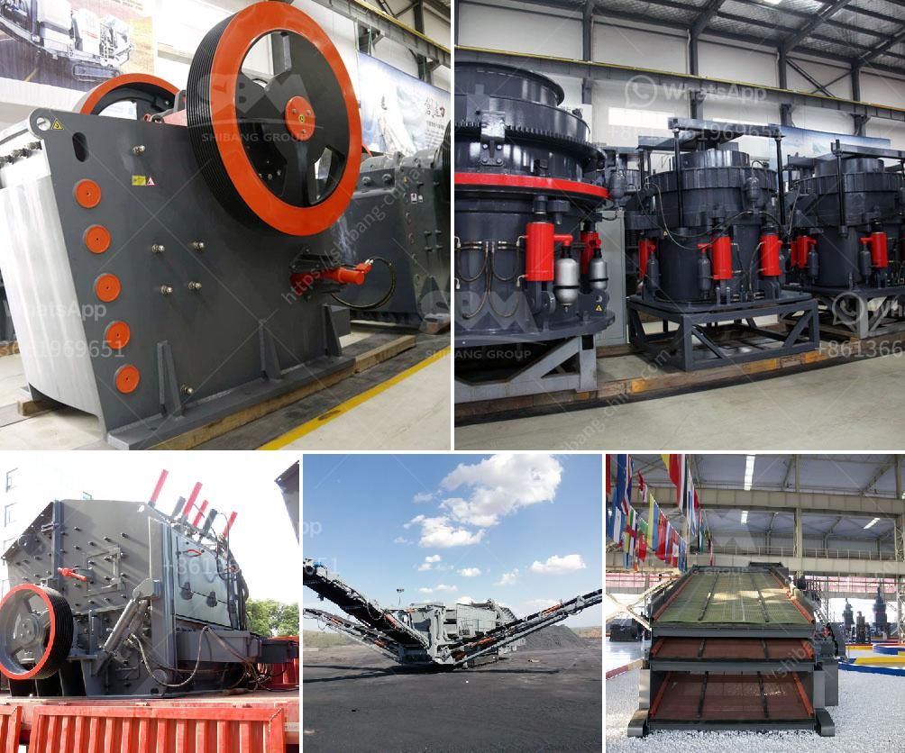

<h3>stone crusher machine malaysia</h3>
Stone Crusher Machine Malaysia is widely used in mining, metallurgy, chemical, construction, highways, railways, and other fields. It is suitable for processing various non-flammable and explosive materials with Mohs hardness less than 7 and humidity below 6%. Due to the abundant resources in Malaysia, stone crusher machine has a wide range of applications in various industries, such as mining, construction, metallurgy, highways, and railways.

In recent years, with the continuous development of the Malaysian economy, the mining industry has been greatly promoted, and various stone crusher machines have been widely used. In order to ensure the efficient operation of the equipment, it is also equipped with advanced electronic control operating system to achieve more efficient operation.

The stone crusher machine Malaysia is a device that crushes large stones or ores into smaller particles, including stones with particle sizes of 1-5 mm, 5-10 mm, 10-25 mm, and 25-50 mm. It can also be used for beneficiation equipment in sand-making industries, stone production lines and ore beneficiation lines. Even in the construction industry, the stone crusher machine is necessary equipment for highway construction, concrete mixing station, etc.

The stone crusher machine can be divided into different types depending on the different crushing principles and particle sizes. In Malaysia, the types of stone crusher machines include jaw crusher, impact crusher, cone crusher, hammer crusher, roll crusher, compound crusher, and so on.

The different types of stone crushers are different in crushing capacity and crushing efficiency. How to choose a suitable stone crusher machine depends on the required final product size, the ore properties, the feeding size, the capacity and so on. The stone crushing plant can be operated as independent units or as a two- or three-stage crushing application: from primary to secondary, tertiary and fine crushing. As required, a portable screen can be attached to the process.

In conclusion, Stone Crusher Machine Malaysia is the best choice for crushing stones and producing aggregates, and sand in construction and road building industry. It has the advantages of low energy consumption, high productivity, simple structure, stable operation and large crushing ratio. It is also very convenient to operate and maintain, and it is very environmental-friendly. Therefore, it is widely used in various industries in Malaysia and has a promising future.
<h3>Contact us</h3><ul><li><strong>Whatsapp:&nbsp;<a href="https://wa.me/8613661969651">+8613661969651</a></strong></li><li><a href="https://swt.shibang-china.com/?git&amp;zhl&amp;stone crusher machine malaysia"><strong>Online Service(chat now)</strong></a></li></ul><h3>Related</h3><ul><li><a href='stone crushing machine manufacturers in japan.md'>stone crushing machine manufacturers in japan</a></li><li><a href='stone crushing plant germany.md'>stone crushing plant germany</a></li><li><a href='design and sizing of a gold processing plant pdf.md'>design and sizing of a gold processing plant pdf</a></li><li><a href='iron crushing equipment cost.md'>iron crushing equipment cost</a></li><li><a href='sale stone quarry crusher plant india.md'>sale stone quarry crusher plant india</a></li></ul>