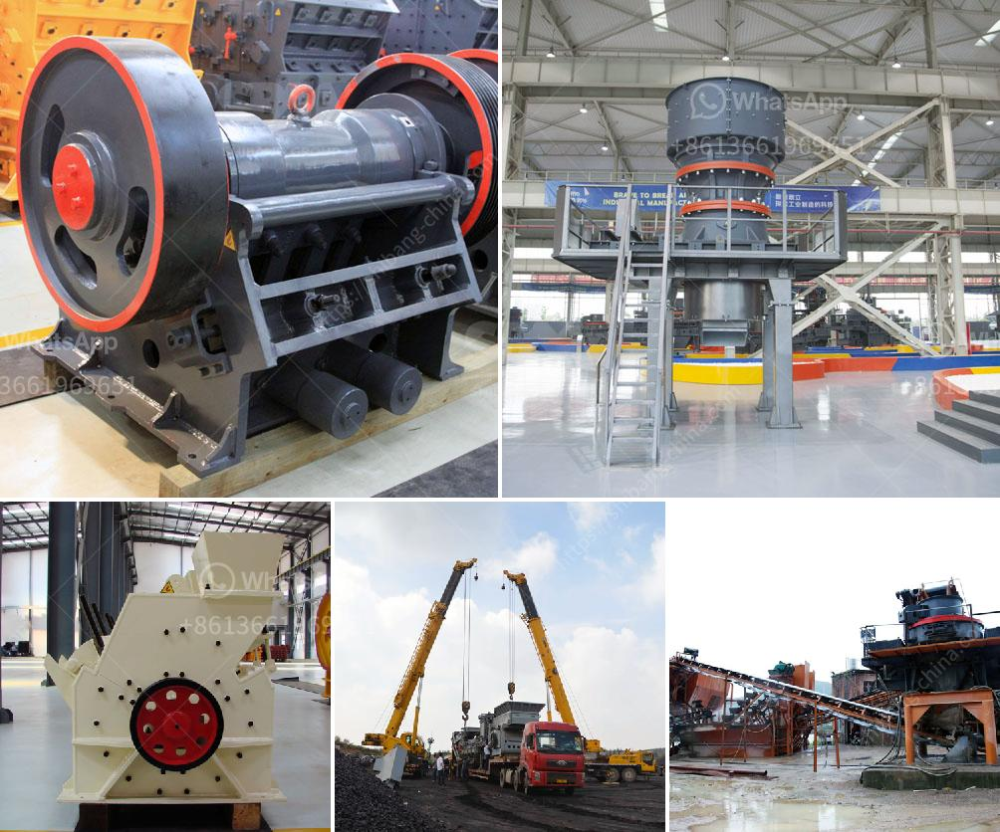

<h3>stone crusher machine or rock breakers</h3>
The stone crusher machine is a very important piece of equipment in many industries, such as mining, metallurgy, building material, highway, railway, water conservancy, and chemical industries. The stone crusher machine is used for the production of aggregates produced in the construction of buildings, roads, bridges, highways, and other infrastructure projects. It has the advantages of large crushing ratio, high production efficiency, low energy consumption, and uniform product size.

The stone crusher machine is mainly used in many industries, such as metallurgy, mining, chemical engineering, etc. It can conduct the secondary and fine crushing operations of various ores and materials of big block. It is widely used in the world for its performance and simplicity in operation. However, in the process of operating the stone crusher machine, there are several things that need to be noted for the normal operation of the machine.

Firstly, the feeding should be uniform and continuous. The machine will become larger in automatic degree if the quantity and size of the materials entering the machine are beyond the standard. When the machine is blocked due to the improper operation, please stop the motor immediately, remove the raw materials, and then restart the machine. If there are materials in the crushing cavity, they should be crushed or cleared before restarting the stone crusher machine.

Secondly, the regular inspection of the main components should be carried out to ensure the reliability of the machine. The bearing parts represent the key parts of the stone crusher machine. They are the parts that bear the whole weight of the machine. Therefore, regular inspection and maintenance is necessary to keep the bearing in good condition. Moreover, the feeding direction should be correct to avoid the damage caused by the overload of the machine. In addition, before each start-up, it is necessary to check whether the gap between each component is reasonable.

Thirdly, the lubrication system should be improved to ensure the smooth operation of the machine. The lubrication system is the guarantee for the normal operation of the machine, especially for the renewable resources industry. The timely and regular lubrication can greatly improve the overall efficiency and service life of the machine.

The stone crusher machine or rock breaker machine is a useful tool for the construction of roads, railways, and buildings. Each machine has its own reasons for choosing it based on your specific requirements. The stone crusher machine has high productivity, small energy consumption, safety use, easy maintenance, and wide range of applications. When buying the machine, what factors should be taken into consideration and make a selection according to different needs? It is very important to choose a stone crusher machine with the correct model and type.

In summary, the stone crusher machine has many advantages, such as high crushing ratio, high productivity, low energy consumption, easy maintenance, and so on. However, the improper use or failure to carry out the necessary maintenance may result in damage to the machine. Therefore, before starting the stone crusher machine, it is necessary to carry out a thorough inspection and make necessary adjustments and measures to ensure the normal operation of the machine.
<h3>Contact us</h3><ul><li><strong>Whatsapp:&nbsp;<a href="https://wa.me/8613661969651">+8613661969651</a></strong></li><li><a href="https://swt.shibang-china.com/?git&amp;zhl&amp;stone crusher machine or rock breakers"><strong>Online Service(chat now)</strong></a></li></ul><h3>Related</h3><ul><li><a href='stone crusher capacity.md'>stone crusher capacity</a></li><li><a href='50tph stone crusher in germany for sale.md'>50tph stone crusher in germany for sale</a></li><li><a href='full crushing plants germiston.md'>full crushing plants germiston</a></li><li><a href='price list stone crusher german.md'>price list stone crusher german</a></li><li><a href='dolomite rock crusher.md'>dolomite rock crusher</a></li></ul>