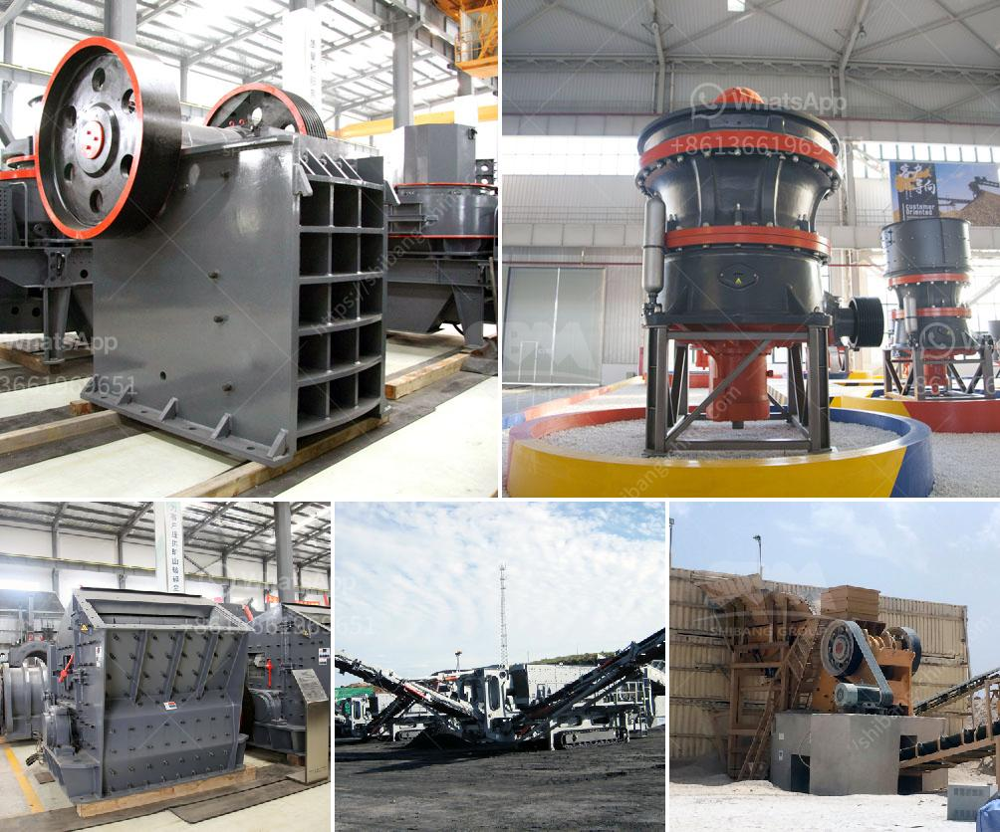

<h3>stone crusher machine plant for sale in pakistan</h3>
Stone Crusher Machine Plant for Sale in Pakistan is a global supplier and manufacturer of crushing, grinding, sand making and beneficiation plant. We provide complete sets stone crusher plant for sale in Pakistan. stone crushing machine is built in robust structure; it can deal any kinds of hard and abrasive stones. The mobile stone crusher is excellent for flexible application in quarry and mine processing. It can be easy move from one working site to another, greatly saving working time and improve the production capacity and output. It has been most favorite crushing plant for quarries, mining and construction industry. We provide stone crusher machine in Pakistan for complete crushing plant in Pakistan.

The jaw crusher is generally used as the primary crusher in the crushing circuit and connects to the ore feeding machine. In the early years, common used plate feeder, but now, the vibrating feeder is more popular. Practice has proved that the vibrating feeder has advantages of low power consumption, strong transportation capacity, low failure rate and easy maintenance, which can fully meet the needs of both of large scale gold plant ore small scale processing plant.

When we refer to stone crusher in Pakistan, we always think about jaw crusher. Jaw crusher is suitable for crushing all kinds of ores and rocks whose compressive strength limit is less than 250 mpa. It is mainly used as the primary crusher or secondary crusher in cement plant and concrete industries. The jaw crusher is divided into three types according to the width of the feeding port: large type, medium type and small type. The models with inlet width greater than 600 mm are large types, between 300 and 600 mm are medium-sized types, less than 300 mm are small types.

Stone Crusher Machine Supplier In Pakistan Stone crusher machine supplier in pakistan stone crusher machine supplier in pakistanrusher machine manufactured crusher machine about double vsi x series crusher is broadly utilized in mobile crusher and mobile screen and it is the very first manufacturer of get a quoteearn more Et a qouteAs a leading global manufacturer of crushing equipment, milling equipment, dressing equipment,drying equipment and briquette equipment etc. we offer advanced, rational solutions for any size-reduction requirements, including quarry, aggregate, grinding production and complete plant plan.
<h3>Contact us</h3><ul><li><strong>Whatsapp:&nbsp;<a href="https://wa.me/8613661969651">+8613661969651</a></strong></li><li><a href="https://swt.shibang-china.com/?git&amp;zhl&amp;stone crusher machine plant for sale in pakistan"><strong>Online Service(chat now)</strong></a></li></ul><h3>Related</h3><ul><li><a href='bauxite mining process flow chart germany.md'>bauxite mining process flow chart germany</a></li><li><a href='100 tonnes crusher for sale south africa.md'>100 tonnes crusher for sale south africa</a></li><li><a href='mining equipment and hire zimbabwe.md'>mining equipment and hire zimbabwe</a></li><li><a href='manufacturer of vibrating screens.md'>manufacturer of vibrating screens</a></li><li><a href='ball mills nigeria.md'>ball mills nigeria</a></li></ul>