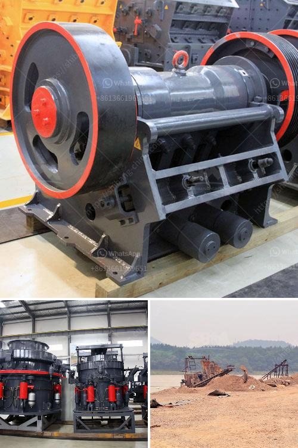

<h3>stone crusher machine price in usa</h3>
Determining factors of stone crusher machine price include the manufacturer, quality, and model. However, the price of the machine is often overlooked because people perceive it as a one-time expense. Instead, it should be viewed as an investment that will yield returns over time.

Various factors influence the price of stone crusher machines in the USA, including the manufacturer's production costs, research and development expenses, market demand, and competition. These factors create a significant variation in the final price of each machine.

In addition to these factors, the capacity, size, and output of the machine are also important considerations. It is essential to choose the right size crusher for different applications as a smaller machine may not be able to produce the required output, whereas a larger machine may be unnecessary and costlier.

The quality of the machine is crucial for its longevity and performance. High-quality machines have a higher price tag due to the use of durable materials and advanced technology. These machines can withstand heavy-duty operations and require minimal maintenance, thus reducing overall operating costs in the long run.

Furthermore, the choice of manufacturer is critical in determining the price of stone crusher machines. Established manufacturers with a reputation for delivering reliable and efficient machines usually charge higher prices than newer or less reputable manufacturers. However, investing in well-known brands ensures better quality and after-sales service.

When considering the price of a stone crusher machine, it is vital to conduct thorough research and compare different options. This will help individuals make an informed decision and choose a machine that meets their requirements and budget.

In conclusion, the price of a stone crusher machine in the USA is influenced by various factors, including the manufacturer, quality, and model. Economic indicators such as inflation and currency exchange rates also have a direct impact on the price. Therefore, it is necessary to conduct proper research and make well-informed decisions when purchasing a stone crusher machine.
<h3>Contact us</h3><ul><li><strong>Whatsapp:&nbsp;<a href="https://wa.me/8613661969651">+8613661969651</a></strong></li><li><a href="https://swt.shibang-china.com/?git&amp;zhl&amp;stone crusher machine price in usa"><strong>Online Service(chat now)</strong></a></li></ul><h3>Related</h3><ul><li><a href='copper ore quarry equipment manufacturer in thailand.md'>copper ore quarry equipment manufacturer in thailand</a></li><li><a href='kaolin processing unit.md'>kaolin processing unit</a></li><li><a href='uses jaw crusher in kenya.md'>uses jaw crusher in kenya</a></li><li><a href='screen astec vibrating screen price.md'>screen astec vibrating screen price</a></li><li><a href='how to make an industrial stone crusher.md'>how to make an industrial stone crusher</a></li></ul>