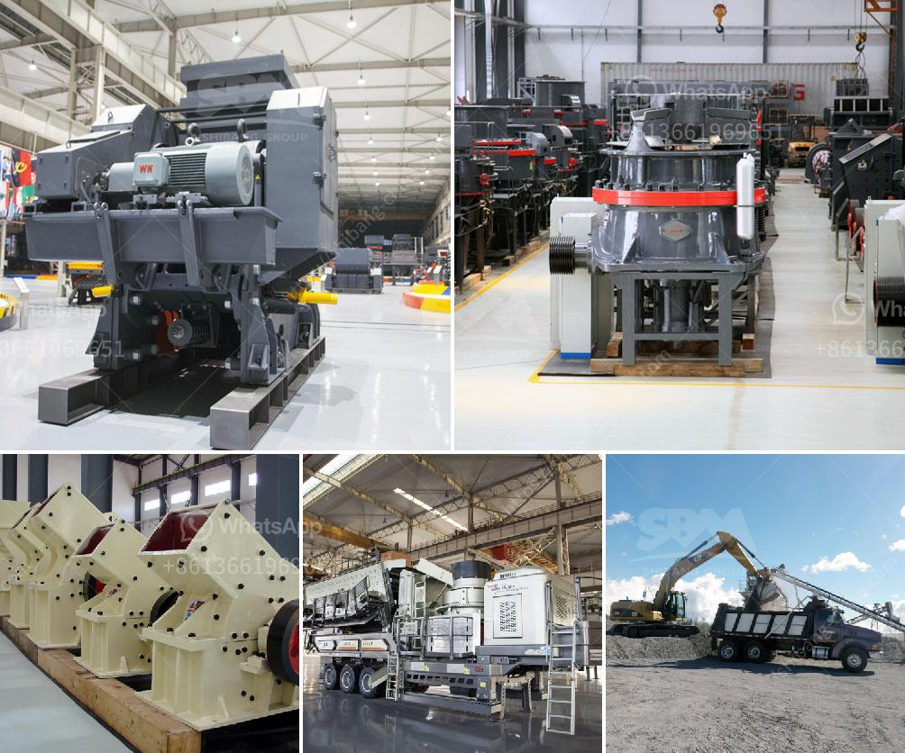

<h3>stone crusher machine price list in kenya</h3>
Stone crusher machine price list in Kenya is an important consideration when purchasing machines to start quarrying mines or factories. There are many stone crusher machine suppliers and manufacturers in Kenya. The machines they sell are various, such as jaw crusher, impact crusher, cone crusher, hammer crusher and so on. These different kinds of crushers can be used in the mineral ore production line.

When dealing with different rocks, we do have different specifications or requirements for the crushers. For instance, we need different raw materials and sizes of the finished products. Then the price list of stone crusher machines in Kenya will be provided to you according to your specific requirements.

The stone crusher machine price list in Kenya includes jaw crusher, cone crusher, impact crusher, hammer crusher, and even VSI crusher machine. The price of stone crusher varies with the type of product. Because different types of crushers have different configurations, the corresponding costs are different, which naturally results in different prices.

Some customers are confused with the price when purchasing the stone crusher machine, especially for mobile jaw crusher plant. In fact, the price of a small jaw crusher will be cheaper, and the price of a big one will be relatively expensive. However, the configuration of the jaw crusher has greatly affected the price, For example, if it is a fixed configuration, it can normally meet general engineering projects. Since the factory can mass produce and there is a certain inventory, the price will be relatively low. But on the contrary, the price that ends up not coming down easily is the mobile jaw crusher plant.

As a matter of fact, the price list of a mobile jaw crusher can be affected by many factors, such as the brand, geographical location, requirements, supply and demand, etc. If you want to get an accurate quotation, it is recommended to communicate with manufacturers directly. So, how much does a mobile jaw crusher cost? For example, please refer to a friend’s inquiry, which is less than the small mobile jaw crusher with a capacity of 85-300 t/h. Compared with the jaw crusher of the same specification, the small mobile jaw crusher has the same price! Because the small mobile jaw crusher has the same output as the fixed jaw crusher, it will be much higher than the cheap configuration offered by some small-scale factories. Therefore, the prices of small mobile crushers are lower than those of large-scale crushers.

Because the manufacturing costs and labor costs of mobile crushers are relatively high, because the machines need to be moved frequently, so the manufacturing costs and labor costs are relatively higher, thus the price of mobile jaw crushers remains relatively high. Therefore, more users are investing in fixed crushers.

As for the market situation, especially for the mining industry, the past two years have been a little of a downturn, so the market is not so good, so it's not a good time to invest in equipment. The price of crushers is high, but the investment threshold for users is low. When purchasing equipment, customers often worry about the price of crushers.

The above article mainly introduced the price of mobile stone crusher machines from different aspects. As more and more users pay attention to this aspect, the price of the equipment will lie in a relatively stable range. In order to satisfy users' requirements in addition to crushing materials, we are constantly improving our services and improving our products to provide customers with more comprehensive access to stone crusher solutions to reduce costs and increase productivity.
<h3>Contact us</h3><ul><li><strong>Whatsapp:&nbsp;<a href="https://wa.me/8613661969651">+8613661969651</a></strong></li><li><a href="https://swt.shibang-china.com/?git&amp;zhl&amp;stone crusher machine price list in kenya"><strong>Online Service(chat now)</strong></a></li></ul><h3>Related</h3><ul><li><a href='south africa gold processing equipment.md'>south africa gold processing equipment</a></li><li><a href='jaw crusher part diagram.md'>jaw crusher part diagram</a></li><li><a href='concrete crusher hire price in south africa.md'>concrete crusher hire price in south africa</a></li><li><a href='vibratory ball mill china.md'>vibratory ball mill china</a></li><li><a href='complete mining equipment in accra ghana.md'>complete mining equipment in accra ghana</a></li></ul>