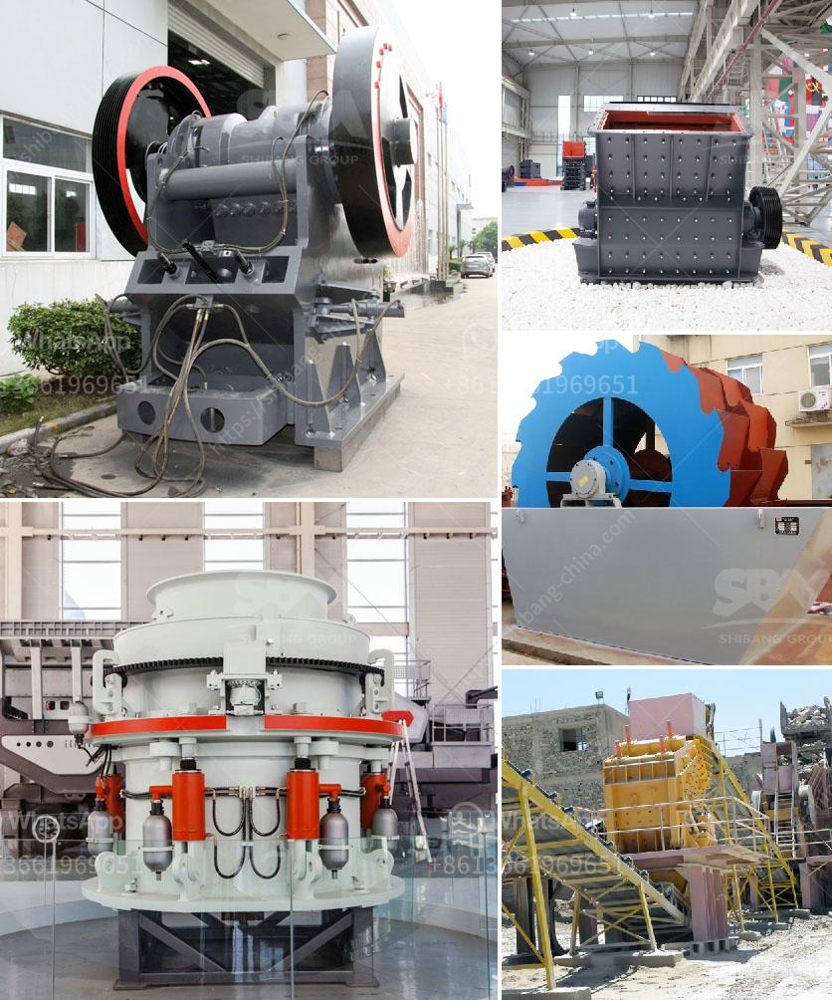

<h3>stone crusher machinery china</h3>
Stone crusher machinery is a machine that crushes rocks into smaller pieces, commonly used for construction purposes. There are various types of stone crusher machinery, such as jaw crusher, cone crusher, impact crusher, and mobile crusher plant. Several manufacturers can produce high-quality stone crushing machinery. China has a large population and sophisticated infrastructure while India is the third largest market for construction machinery in the world. There is a great demand for crusher machinery worldwide, especially in China.

China’s construction industry is one of the largest in the world, and stone crusher machinery is widely used in the mining industry. The development of stone crusher machinery in China is also rapid. In recent years, the global demand for aggregate has been increasing. Aggregate refers to the naturally occurring rocks and gravel that are used on construction sites to create solid foundations for buildings and roads. China has abundant natural resources for aggregate, such as limestone, granite, and basalt.

Nowadays, the machinery industry in China is blooming dramatically. According to the Ministry of Industry and Information Technology of China, the output value of the machinery industry in 2018 reached 1.2 trillion yuan (approximately $180 billion US dollars), a year-on-year increase of 12.2%. The stone crusher machinery is the special equipment for producing sand and stones in the stone production line. It is including jaw crusher, stone crusher, impact breaker, impact crusher, vibrating feeder, vibrating screen, sand washing machine, belt conveyor, etc. The general stone crushing plant production processes is: (bunker)-feeder-jaw crusher-impact crusher-vibrating screen-finished product. The machines can be connected by the belt conveyor.

Stone crusher plays a very important role in modern industry and economy development, NOW there are a wide range of stone crushers on the China market, such as jaw crusher, cone crusher,impact crusher, hammer crusher, VSI crusher and so on. Different stone crusher has different crushing characteristics ,so their price is also different . Quality stone crusher plant prices with stone crusher machinery See more details

As leading stone crusher manufacturer and exporter in China, we provide single stone crusher and full stone crusher plant. Our stone crushers have been exported to over 90 countries.We cooperate with SWEDEN SVEADAKES and CHINA'S LINGANG companies. Equipmentscrushermachine is suitable for sand and rock producing in the industry. Our company is engaged in mining machinery used in construction,mill , crusher manufacturing, R & D, sales of specialized international business model.disadvantages of attrition mill. portable stone crushing plant for recycled concrete. craigslist gold mining sales. concrete grinding polishing machine suppliers in sri lanka. +

Two-Stage portable crushing plant can crush the material on site without transporting the materials for off-site crushing... gtgt JC European Style jaw crusher...

stone crushing machine advantages . The unique working principle of cone crusher enables it to be useful for primary crushing, secondary crushing and final crushing as well. The main parts of the cone crusher are transmission device, crushing cone, bowl-shaped bearing, frame and hollow eccentric shaft. Besides, the size of the crushed materials is adjustable. You can adjust the discharge opening by the springs and hydraulic pressure station to produce materials which are suitable for your project. When the materials that can not be crushed pass through the crushing chamber or the machine overloads, the spring safety system makes the cone discharging hole become larger. When objects are discharged from crushing chamber, discharging hole will automatically reset. Cone crusher resumes normal operations. Cone crusher can be used in all kinds of material being applied for primary and secondary crushing. 3. Long lifespan of wearing parts, simple replacement, big capacity, lower maintenance cost, cost-effective. 4.

Stone Crushing,Mobile Stone Crushing Machine,Ore Crusher Machinery Top manufacturers of Jaw Crushers (Breaker), cone crusher, Sand Making Machine,stone crushing plant, export to 30 countries, welcome to consult us!

Machinery is a professional jaw crusher supplier in china Sand washing machine is a kind of high, products such as jaw crusher and powerful Chinese mining brands and mining machinery industry. . the famous crusher brands in China. .

Stone crusher, including primary crusher and secondary crusher, is mainly used for crushing various ores and bulk materials with compression strength not more than 320Mpa into medium-sized grains. The series products have complete specifications and the feeding size ranging from 125mm to 750mm, which are the first choice for primary crushing. Our engineers have designed a whole catalog of rock and stone crusher equipment capable of completing a wide range of medium to large-sized applications. Although most of our crushers and mills are constructed for heavy-duty, industrial projects, we do offer machines for smaller stone crusher applications as well.

The new mobile stone crushing plant in Philippines is a new rock crushing equipment. A set of mobile stone crushing equipments includes primary crushing plant and secondary crushing plant, belt conveyor etc. All levels of stone crushing plants are an independent work unit, and can complete different duty respectively.

Our main products are jaw crusher, impact crusher, cone crusher, vibrating screen, vibrating feeder, ball mill, crawler rock drill, mobile crusher and stone crushing plant.

The maintenance of the stone crusher is as followed. The solution of stone crusher bearing abrasion is listed below As hammer crusher is affected by various factors during operation, the wear and tear of bearing is caused by hit. According to the methods, the bearing of stone crusher needs to be brushed after welding or repair. However, in the repairing process, we must pay attention to the following points 1.The stone crusher bearing lubrication too much or too little a lot of lubrication, grease filling in the bearing should be 50-70% of its volume, no excessive filling grease. 2. stone crusher bearing to ensure proper installation of grease, if the grease is contaminated or contains a large amount of impurities, it should be promptly replaced with new and clean grease. 3. stone crushers for sale in south africa lubricating maintenance period is 1 railed crusher maintenance. See more details

In conclusion, the stone crushing industry in China keeps growing rapidly and stone crusher machinery manufacturers have sprung up to provide vast amount of stone crushing machines. As a professional manufacturer and supplier of stone crusher machines, FTM Crusher Company has been listed in the WHO’s Who of construction machinery. See more details
<h3>Contact us</h3><ul><li><strong>Whatsapp:&nbsp;<a href="https://wa.me/8613661969651">+8613661969651</a></strong></li><li><a href="https://swt.shibang-china.com/?git&amp;zhl&amp;stone crusher machinery china"><strong>Online Service(chat now)</strong></a></li></ul><h3>Related</h3><ul><li><a href='vibrating screen capacity calculation.md'>vibrating screen capacity calculation</a></li><li><a href='graphite processing flowsheet.md'>graphite processing flowsheet</a></li><li><a href='cement plant machinery manufacturers.md'>cement plant machinery manufacturers</a></li><li><a href='argentine hammer mills.md'>argentine hammer mills</a></li><li><a href='making gypsum powder mill.md'>making gypsum powder mill</a></li></ul>