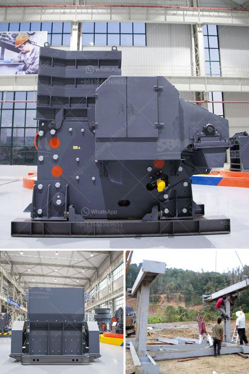

<h3>stone crusher machinery manufacturers</h3>
Stone Crusher Machinery Manufacturers are the modern-day answer for businesses that want to expand their opportunities and increase their income potential. The industry utilizes a wide variety of equipment and technology to enable manufacturers to crush various raw materials like rocks, stones, and even ores, into smaller sizes that are more manageable and easier to handle. 

One of the primary benefits of using stone crusher machinery is that it enables businesses to ensure that their raw materials are of consistently high quality. Crushing machines are designed to break down the larger rocks and stones into smaller pieces, ensuring that they are suitable for a variety of uses. Whether it is for road construction, building materials, or even landscaping purposes, stone crushers can provide the necessary materials in the required sizes, consistently and efficiently.

Moreover, stone crusher machinery manufacturers employ advanced technology that improves the performance of their machines. This industry has seen significant advancements in recent years, with manufacturers embracing automation, computerized control systems, and even remote monitoring capabilities. These technological innovations have made stone crusher machines more reliable, efficient, and productive.

In addition to enhancing the quality of the final product and the performance of the machines, stone crusher machinery manufacturers also focus on enhancing the safety features. These machines often work in hazardous conditions, and ensuring the safety of the operators and workers is of paramount importance. Manufacturers prioritize the inclusion of safety devices and mechanisms that minimize accidents and injuries. By investing in advanced safety features, stone crusher machinery manufacturers foster a safer working environment.

With the global construction industry growing at a rapid pace, the demand for stone crusher machinery is also increasing. As a result, the competition among manufacturers is fierce. Manufacturers constantly strive to improve their machines' functionality, productivity, and reliability to gain a competitive edge. This intense competition benefits businesses as it leads to better quality products, competitive pricing, and superior customer service.

Choosing the right stone crusher machinery manufacturer is crucial for businesses looking to invest in this equipment. Reputable manufacturers will have a solid track record, a wide range of products to choose from, and a strong customer base. They will also offer comprehensive after-sales service, such as spare parts availability and technical support. Additionally, they will provide clear and transparent pricing structures and ensure that their machines comply with industry standards and regulations.

In conclusion, stone crusher machinery manufacturers play a crucial role in the construction industry. By providing high-quality, reliable, and efficient machinery, they enable businesses to process raw materials into smaller, more manageable sizes. Thanks to advanced technology and safety features, these machines are becoming increasingly dependable and secure for workers. Furthermore, the intense competition within the industry benefits businesses, resulting in superior products and competitive pricing. By choosing reputable manufacturers, businesses can rest assured that they are investing in the right equipment for their needs.
<h3>Contact us</h3><ul><li><strong>Whatsapp:&nbsp;<a href="https://wa.me/8613661969651">+8613661969651</a></strong></li><li><a href="https://swt.shibang-china.com/?git&amp;zhl&amp;stone crusher machinery manufacturers"><strong>Online Service(chat now)</strong></a></li></ul><h3>Related</h3><ul><li><a href='kaolin processing equipment manufacturers in germany.md'>kaolin processing equipment manufacturers in germany</a></li><li><a href='vertical mill for slag grinding.md'>vertical mill for slag grinding</a></li><li><a href='crusher for sale in kerala.md'>crusher for sale in kerala</a></li><li><a href='gold production process flow chart.md'>gold production process flow chart</a></li><li><a href='dry process for gold recovery.md'>dry process for gold recovery</a></li></ul>