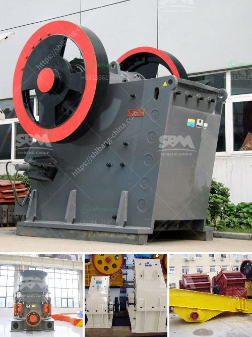

<h3>stone crusher machinery suppliers</h3>
With the continuous development of the construction industry, the demand for stone crusher machinery has increased significantly. In order to meet this demand, there are many manufacturers and suppliers of stone crusher machinery. However, not all of them can provide high-quality machines, so you need to be very careful when choosing a supplier.

To ensure the quality of the machines, it is important to check the reputation of the supplier. A reliable and reputable supplier will have a good track record in the industry. You can read reviews and testimonials from previous customers to get an idea of the supplier's reputation. Additionally, you can ask for references from the supplier and contact them to inquire about their experience with the supplier.

In addition to reputation, it is also important to consider the technical expertise of the supplier. A good supplier should have a team of skilled engineers who are knowledgeable about stone crusher machinery. They should be able to provide you with professional advice and guidance on the selection and operation of the machines.

Another important factor to consider is the availability of spare parts and after-sales service. Stone crusher machinery is prone to wear and tear, so it is advisable to have spare parts and after-sales service readily available to prevent downtime when necessary. This will help ensure the smooth operation of the machine and uninterrupted production.

A reliable supplier will also provide training and technical support for the machine to ensure its proper operation. This will help your staff to understand the machine, properly operate it, and prevent accidents.

Lastly, consider the cost of the machine. Stone crusher machinery is expensive, so it is essential to consider all your options before making a purchase. Seek quotations from different suppliers to get competitive prices. By doing so, you can ensure that you get the best value for your money.

In conclusion, finding a reliable stone crusher machinery supplier is essential for your business. You need to consider crucial factors such as reputation, technical expertise, availability of spare parts and after-sales service, and cost to select the best supplier for your project. Remember to thoroughly evaluate each supplier before making a decision.
<h3>Contact us</h3><ul><li><strong>Whatsapp:&nbsp;<a href="https://wa.me/8613661969651">+8613661969651</a></strong></li><li><a href="https://swt.shibang-china.com/?git&amp;zhl&amp;stone crusher machinery suppliers"><strong>Online Service(chat now)</strong></a></li></ul><h3>Related</h3><ul><li><a href='used stone crusher machine price.md'>used stone crusher machine price</a></li><li><a href='vertical roller mill for cement grinding.md'>vertical roller mill for cement grinding</a></li><li><a href='cone crusher contractors in egypt.md'>cone crusher contractors in egypt</a></li><li><a href='rock sand plant feasibility report.md'>rock sand plant feasibility report</a></li><li><a href='limestone crushing equipment.md'>limestone crushing equipment</a></li></ul>