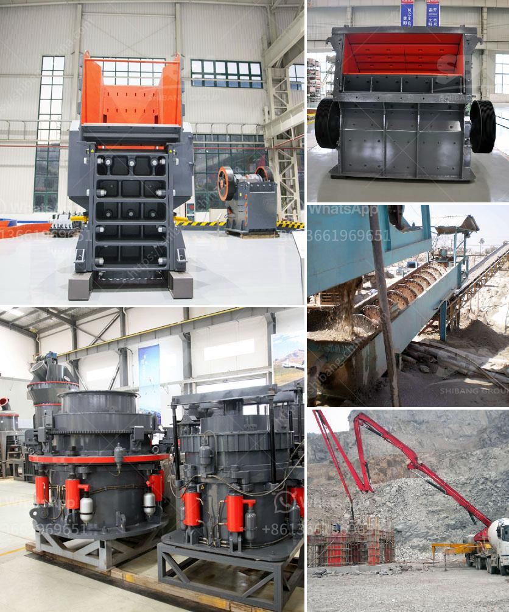

<h3>stone crusher machines from denmark</h3>
Stone crusher machines from Denmark are highly efficient and inclusive pieces of equipment that deliver diverse functions in stone crushing. They come in an extensive range of sizes and capacities, offering users ample flexibility to meet their specific requirements. The machines are embraced globally due to their excellent build quality, low maintenance needs, and reliable performance.

One of the key advantages of stone crusher machines from Denmark is their ability to crush materials of various hardness levels. These machines can efficiently process both soft and hard rocks, ensuring the production of high-quality aggregates for different construction projects. Whether it be limestone, granite, basalt, or any other type of stone, these machines can swiftly and effectively crush them into desired sizes.

Denmark's stone crusher machines are cost-effective and reliable. The sturdy construction of these machines ensures minimal downtime and longevity. This is further enhanced by the availability of a wide range of replaceable wear parts, allowing users to easily maintain and repair the machines whenever necessary.

The stone crusher machines from Denmark also boast a high degree of automation, reducing manual intervention, and improving overall productivity. Many models feature advanced control systems that enable operators to monitor and control the entire crushing process easily. This increases efficiency and decreases the chances of human error, resulting in improved safety and higher output.

Apart from their exceptional performance, stone crusher machines from Denmark are also environmentally friendly. With a high level of dust and noise suppression mechanisms, these machines ensure a cleaner and quieter work environment. This is indispensable in locations where noise and dust pollution must be kept to a minimum, such as urban areas or near residential quarters.

Furthermore, stone crusher machines from Denmark often come with innovative features that enhance productivity. Some machines feature adjustable settings that allow users to vary the output size, making it easier to achieve specific requirements for various construction applications. Additionally, some machines can also be equipped with screening units to separate different sizes of crushed materials, enabling the production of a variety of aggregates.

In conclusion, stone crusher machines from Denmark are highly efficient, robust, and reliable pieces of equipment that allow for efficient stone crushing in various construction applications. With their wide range of sizes, capacities, and innovative features, these machines are versatile and can meet the demands of any project. Whether it's crushing soft or hard rocks, producing different sizes of aggregates, or prioritizing environmental factors, stone crusher machines from Denmark offer a comprehensive solution. Their excellent build quality, low maintenance requirements, and advanced automation ensure long-term reliability and cost-effectiveness. Investing in stone crusher machines from Denmark is a wise decision that guarantees high-quality crushing and productivity in construction projects around the world.
<h3>Contact us</h3><ul><li><strong>Whatsapp:&nbsp;<a href="https://wa.me/8613661969651">+8613661969651</a></strong></li><li><a href="https://swt.shibang-china.com/?git&amp;zhl&amp;stone crusher machines from denmark"><strong>Online Service(chat now)</strong></a></li></ul><h3>Related</h3><ul><li><a href='roller machines for milling.md'>roller machines for milling</a></li><li><a href='slag powder machine.md'>slag powder machine</a></li><li><a href='limestone crushing.md'>limestone crushing</a></li><li><a href='cement industries ball coal mill.md'>cement industries ball coal mill</a></li><li><a href='copper ore quarry equipment manufacturer in thailand.md'>copper ore quarry equipment manufacturer in thailand</a></li></ul>