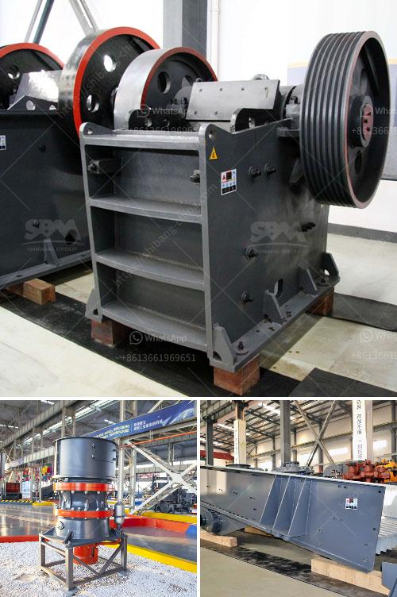

<h3>stone crusher maker in india</h3>
Stone crushing industry is an important industrial sector in the country. The crushed stone is then used as raw material for various construction activities i.e. construction of roads, bridges, buildings and canals. Over the last 10 years, the Construction sector has been registering strong growth rates in the range of 7-8%. Housing and construction is one of the major drivers of growth in more than 40 allied industries including STONE CRUSHING.

In addition, for the building of roads, flyovers and bypasses, there is a mass and consistent need of crushed stone across the country. Several projects are in progress and are being commenced shortly which will have a huge demand for crushed stone materials.

With such a huge demand for crushed stones, manufacturers of stone crushing equipment have expanded their production capacity manifold. Due to the availability of raw materials, stone crusher machinery has become a highly sought after product in the construction sector in recent years.

India is the largest producer of stone crusher machinery such as jaw crusher, hammer crusher, impact crusher, and cone crusher in India. The mobile crushing plant is also used for mining, quarrying, recycling and waste management applications.

The mobile crusher maker in India is the latest technology machinery that is mostly used in today’s mining, construction, quarrying, recycling, and mining applications. The mobile crushing plant is used to process large rocks, broken stones, stones with medium hardness, easy to move on a variety of terrains, provides operational flexibility, improves efficiency, and reduces the cost of transportation.

Stone crusher manufacturers in India still maintain significant shares in the market. Over the years, the increasing popularity of stone crushers in India has attracted a large number of foreign customers. Supported by a team of diligent professionals, we are offering stone crushing, screening, and washing solutions for our clients.

In order to meet the market demands, our engineers have developed a new technology for mobile stone crushing production line. Our crusher plant is typically designed with two-stage crushing process and is ideal for small-scale producer. This plant offers several distressed features to cater to the demands of our clients.

With a large crushing capacity and high versatility, our mobile series machines are extensively used in quarry and mine ore crushing, recycling of construction waste, construction aggregate, highway, railway, bridge and the production of construction industry.

Our stone crusher machines are suitable for a wide range of materials, including concrete, aggregates, limestone, cobblestone, basalt, granite, sandstone, and marble, etc.

With several years of experience in the industry, we are capable of offering reliable quality machines through continuous research and development practices. The machines we manufacture are highly efficient, cost-effective, and environmentally friendly.

In conclusion, stone crushing industry is an important industrial sector in India, especially for infrastructure projects. The demand for high-quality crushed stones will continue to increase over the years. With the constant improvement in technology, stone crusher makers in India are striving hard to provide better quality machines for their customers.
<h3>Contact us</h3><ul><li><strong>Whatsapp:&nbsp;<a href="https://wa.me/8613661969651">+8613661969651</a></strong></li><li><a href="https://swt.shibang-china.com/?git&amp;zhl&amp;stone crusher maker in india"><strong>Online Service(chat now)</strong></a></li></ul><h3>Related</h3><ul><li><a href='salcu powder washing machine.md'>salcu powder washing machine</a></li><li><a href='how to make a stone breaker.md'>how to make a stone breaker</a></li><li><a href='puzzolana 200 tph stage aggregate crushing.md'>puzzolana 200 tph stage aggregate crushing</a></li><li><a href='gold mining company tanzania.md'>gold mining company tanzania</a></li><li><a href='used machines philippines ball mill.md'>used machines philippines ball mill</a></li></ul>