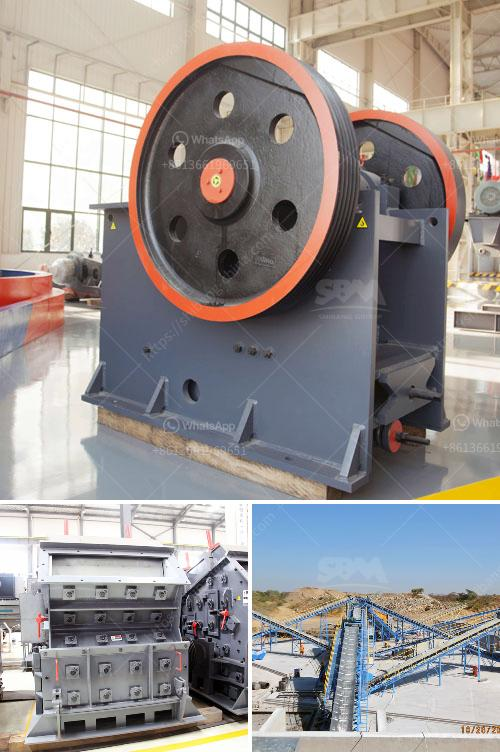

<h3>stone crusher manufacturer in china</h3>
With 25 years’ industry experience, Hongxing Group is one of the leading stone crusher manufacturer in China. We have been devoted to the research, development, and production of mining machinery and crushing equipment. Our skilled team of engineers and technicians are dedicated to providing superior technical support and solutions for our customers.

Our stone crushers are widely used in various fields, such as mining, quarry, construction, road and railway construction, metallurgy, water conservancy, and chemical industry. We have a wide range of models of stone crushers, including jaw crushers, cone crushers, impact crushers, vertical shaft impact crushers, hammer crushers, and roll crushers. These different types of crushers can be used to process all kinds of rocks and ores with different hardness levels.

The key to our success lies in our commitment to quality control and customer satisfaction. We strictly adhere to ISO9001:2015 and CE international standards to ensure that our products meet the highest quality requirements. Our advanced production facilities and strict quality management system enable us to deliver top-notch crushers that are efficient, reliable, and durable.

In addition to our high-quality products, we also provide comprehensive pre-sales and after-sales services. Our dedicated customer service team is available 24/7 to answer any questions and provide technical support. We also offer customized solutions to meet specific customer requirements, such as different crushing capacities and output sizes.

As a responsible manufacturer, we also take environmental protection seriously. We have implemented eco-friendly technologies and practices in our production processes to minimize environmental impact.

With our reliable products, excellent customer service, and commitment to quality, we have established a strong reputation both in domestic and international markets. Our stone crushers have been exported to over 120 countries and regions, including Southeast Asia, Eastern Europe, South America, Middle East, and Africa.

Choose Hongxing as your stone crusher manufacturer in China, and enjoy our reliable products and services that will exceed your expectations.
<h3>Contact us</h3><ul><li><strong>Whatsapp:&nbsp;<a href="https://wa.me/8613661969651">+8613661969651</a></strong></li><li><a href="https://swt.shibang-china.com/?git&amp;zhl&amp;stone crusher manufacturer in china"><strong>Online Service(chat now)</strong></a></li></ul><h3>Related</h3><ul><li><a href='ball mill feed spout sale.md'>ball mill feed spout sale</a></li><li><a href='crusher machine ball media.md'>crusher machine ball media</a></li><li><a href='famous stone cone crusher for mining industry.md'>famous stone cone crusher for mining industry</a></li><li><a href='used stone crusher mashines usa.md'>used stone crusher mashines usa</a></li><li><a href='small hammer crusher.md'>small hammer crusher</a></li></ul>