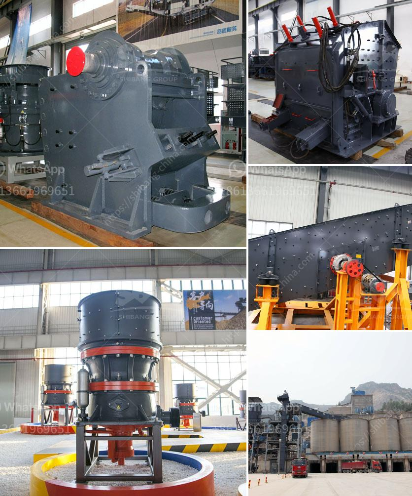

<h3>stone crusher nigeria</h3>
Stone crusher industry in Nigeria is experiencing a great boom. Nigeria has numerous stones and it has a large number of stone crushers to meet the growing demand for crushed stones. Increasing investment in stone crushing and quarrying industry in Nigeria will enhance the market growth in the coming years.

Stone crushing business plays a crucial role in industrial and economic development in Nigeria. The industry is experiencing immense growth due to the large-scale expansion of construction activities, such as roads, highways, bridges, buildings, and canals, and also the rising international investments in infrastructure development in the country. As a result, the demand for crushed stones is increasing exponentially.

Stone crushers are machines designed to reduce large rocks into smaller stones, gravels, or rock dust. They may be used to reduce the size, or change the form, of waste materials so they can be more easily disposed of or recycled, or to reduce the size of a solid mix of raw materials (as in rock ore), so that pieces of different composition can be differentiated. Stone crushers are widely used in mining, metallurgy, building materials, roads, railways, water conservancy, chemical and other industries.

In Nigeria, the stone crushing industry has been growing rapidly due to the increasing demand for different types of crushed stones. These products are used for various construction purposes. The current trend in the construction industry in Nigeria is the increased demand for affordable housing units, which has resulted in a boost in the construction sector. This, in turn, has driven the demand for crushed stones.

Stone crushing in Nigeria is a vibrant, fast-growing industry, and it is highly competitive with a low entry barrier. The key players in the stone crushing industry include crushers and screeners. These machinery are generally used to break down large rocks or aggregate material into smaller sizes. Crushers and screeners use mechanical force to break down large rocks into smaller and more manageable pieces. The crushed stones are used in various construction activities, such as building foundations, roads, bridges, and drainage systems.

The stone crusher industry in Nigeria is expected to witness significant growth in the coming years. This is due to the growing demand for crushed stones from the construction sector, which is projected to drive the market growth. Furthermore, increasing investments in infrastructure development projects, such as roads, highways, and airports, are anticipated to boost the demand for crushed stones.

Despite the growth potential, the stone crusher industry in Nigeria faces several challenges. The industry is highly fragmented, with many small-scale players operating in the market. Lack of skilled manpower, inadequate infrastructure, and outdated technology are some of the challenges faced by the industry. Additionally, mining activities for raw materials pose environmental risks, such as deforestation, land degradation, and water pollution. The industry needs to address these challenges to sustain its growth trajectory.

In conclusion, the stone crusher industry in Nigeria is witnessing rapid growth due to the increasing demand for crushed stones from the construction sector. The industry is poised for further expansion with the rise in investments in infrastructure development projects. However, challenges such as lack of skilled manpower and outdated technology need to be addressed for sustainable growth.
<h3>Contact us</h3><ul><li><strong>Whatsapp:&nbsp;<a href="https://wa.me/8613661969651">+8613661969651</a></strong></li><li><a href="https://swt.shibang-china.com/?git&amp;zhl&amp;stone crusher nigeria"><strong>Online Service(chat now)</strong></a></li></ul><h3>Related</h3><ul><li><a href='pictures of coal mining equipment.md'>pictures of coal mining equipment</a></li><li><a href='conveyor belts in zambia.md'>conveyor belts in zambia</a></li><li><a href='iron slag crushing ball mill price.md'>iron slag crushing ball mill price</a></li><li><a href='micro grinding machine.md'>micro grinding machine</a></li><li><a href='ball mill suppliers india stone crusher machine.md'>ball mill suppliers india stone crusher machine</a></li></ul>