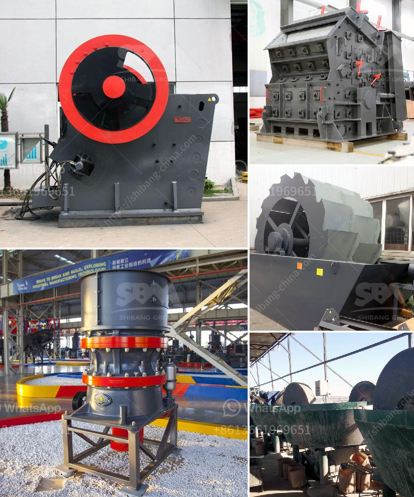

<h3>stone crusher of mandibila in argentina</h3>
The stone crusher of mandibila is an essential piece of machinery, as it is responsible for reducing large-sized rocks into smaller ones that can be further used for various construction purposes. This powerful machine is commonly used in the mining industry, where it breaks down the larger rocks into manageable sizes to extract valuable minerals or other materials.

In Argentina, the stone crusher of mandibila has gained immense popularity due to its numerous benefits and applications. With its high efficiency and robust construction, it has become a crucial tool for the country's infrastructure development projects. Whether it is road construction, building construction, or any other civil engineering project, the mandibila stone crusher plays a pivotal role in ensuring a smooth and successful process.

One of the primary advantages of using a stone crusher of mandibila is its ability to handle various types of rocks and materials. From hard granite to soft limestone, this versatile machine can handle them all effortlessly. The machine consists of two jaws, one fixed and the other moving, which work together to crush the rocks. The moving jaw exerts force on the rocks by applying pressure, while the fixed jaw provides stability to the machine.

Additionally, the stone crusher of mandibila offers high productivity and a low maintenance requirement. Its robust design ensures that it can withstand even the most demanding working conditions without any significant wear or tear. Furthermore, the machine is equipped with advanced technologies and features that make the crushing process more efficient and safe. From automatic lubrication systems to intelligent control panels, every aspect is designed to optimize performance and minimize downtime.

Furthermore, the mandibila stone crusher is known for its energy efficiency. It is built with advanced mechanisms and components that minimize energy consumption during the crushing process. This not only helps in reducing operational costs but also contributes to sustainable development by minimizing environmental impact.

In Argentina, where mining activities are significant, the stone crusher of mandibila plays a vital role in extracting minerals. Whether it is gold, silver, copper, or any other valuable metal, this powerful machine ensures efficient extraction without damaging the mineral deposits.

Moreover, the stone crusher of mandibila also helps in recycling and reusing construction waste. With its ability to crush and break down large rocks into smaller sizes, it becomes easier to reuse the waste material for other construction purposes. This not only saves costs but also reduces the burden on natural resources, leading to a more sustainable construction industry.

In conclusion, the stone crusher of mandibila is an indispensable machine for various construction projects in Argentina. With its ability to crush a wide range of rocks and materials, it ensures efficient extraction of minerals and recycling of construction waste. Its robust construction, high productivity, and energy efficiency make it a popular choice among contractors and project managers. As Argentina continues to develop its infrastructure, the mandibila stone crusher will play a crucial role in shaping the country's construction industry.
<h3>Contact us</h3><ul><li><strong>Whatsapp:&nbsp;<a href="https://wa.me/8613661969651">+8613661969651</a></strong></li><li><a href="https://swt.shibang-china.com/?git&amp;zhl&amp;stone crusher of mandibila in argentina"><strong>Online Service(chat now)</strong></a></li></ul><h3>Related</h3><ul><li><a href='ouedkniss station concassage.md'>ouedkniss station concassage</a></li><li><a href='jaw crusher saudi small capacity.md'>jaw crusher saudi small capacity</a></li><li><a href='cement plant feasibility report.md'>cement plant feasibility report</a></li><li><a href='barite processing plant feasibility study.md'>barite processing plant feasibility study</a></li><li><a href='used philippines jaw crushers.md'>used philippines jaw crushers</a></li></ul>