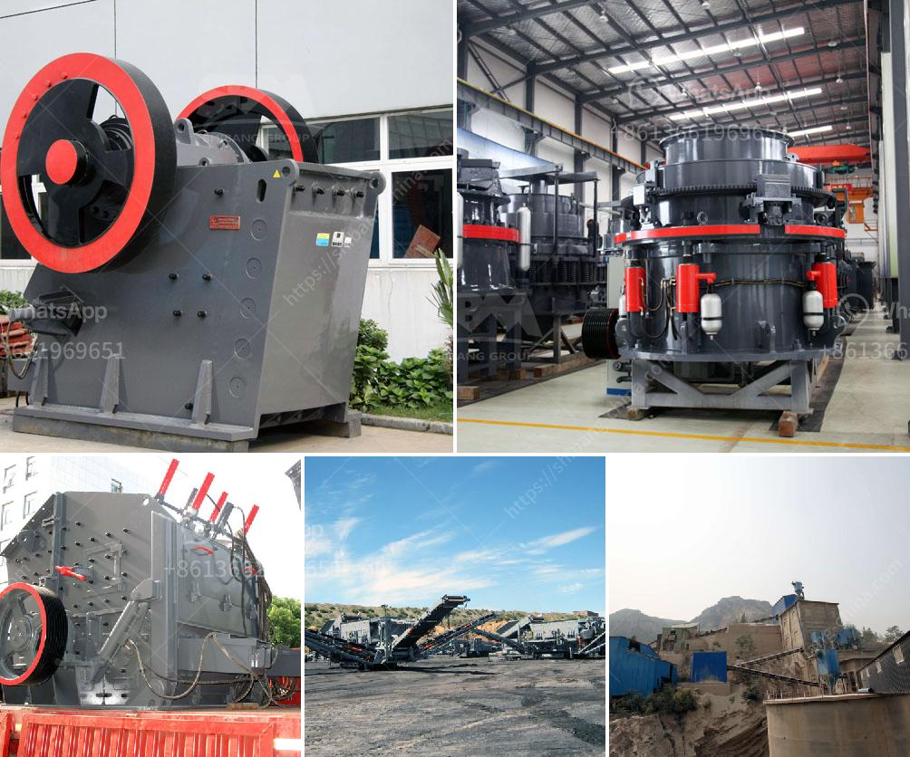

<h3>stone crusher plant cost saudi</h3>
Stone crusher plant cost Saudi is the 21st century's most reliable and efficient way of leading the mining industry. This is through their ability to keep materials for a long period, along with insignificant depreciation rates. The finished products, therefore, have a long shelf life, along with an negligible consumption rate of parts. 

The stone crushing plant integrates hopper, vibrating feeder, jaw crusher, cone crusher, impact crusher, vibrating screen, belt conveyor, and electric control panel, etc. Its designed throughput generally is 50-600 t/h. Sand washing and other machines can be added to this line to meet the various customers' requirements.

Stone crusher plant has integrated unit equipment installation form, which could reduce the complex site infrastructure installation work of the component parts, and reduces the consumption of materials and working hours. The reasonable and compact space stone crusher plant layout of the unit enhances the flexibility of the site. 

With the diesel generator design of the whole production line, the crushing process of mobile jaw crusher is widely used in the crushing of various ores in the mining industry. With the advantage of having a stable structure at high speeds, this ensures high reliability. It is easy to operate, the crushing chamber is deep, and it supports high production rates due to the large crushing space and the powerful motor.

In addition to these, it also has the ability to adjust the size of the discharge opening with the hydraulic system, avoiding the occurrence of congestion. The low noise during operation also ensures the momentous reduction of noise pollution.

The cost of this crusher plant is also very reasonable and economic for their customers. The whole crusher plant provides a low-cost operation mode, which greatly saves the territory. The space layout optimizes the positioning of the crushing system, reduces the investment and reduces the transportation cost of materials. Moreover, the equipment can be combined freely according to the users’ requirements of raw material types and sizes with full varieties of configurations.

With the continuing development of the construction industry, the demand for stones is increasing. To meet the needs of the construction industry, stone crusher plants are increasing in demand. Therefore, the investment in stone crusher plant has been a popular choice for projects investment.

Our stone crusher plant can crush most of stones , include the hard rocks, high capacity with competitive price. Please show us your phone number, our sales manager will call you back ,and make the crushing design for you. This will save you a lot of time and money. So, if you want to invest in the stone crusher plant, please let us know your raw material details, output requirements, price budget, etc. We will provide you with the right product and the best price.
<h3>Contact us</h3><ul><li><strong>Whatsapp:&nbsp;<a href="https://wa.me/8613661969651">+8613661969651</a></strong></li><li><a href="https://swt.shibang-china.com/?git&amp;zhl&amp;stone crusher plant cost saudi"><strong>Online Service(chat now)</strong></a></li></ul><h3>Related</h3><ul><li><a href='types of belt conveyors used in cement industries.md'>types of belt conveyors used in cement industries</a></li><li><a href='crusher equipment oman in muscat oman.md'>crusher equipment oman in muscat oman</a></li><li><a href='stone crusher baler.md'>stone crusher baler</a></li><li><a href='mobile crusher for hire in ghana.md'>mobile crusher for hire in ghana</a></li><li><a href='mini crusher hire johannesburg.md'>mini crusher hire johannesburg</a></li></ul>