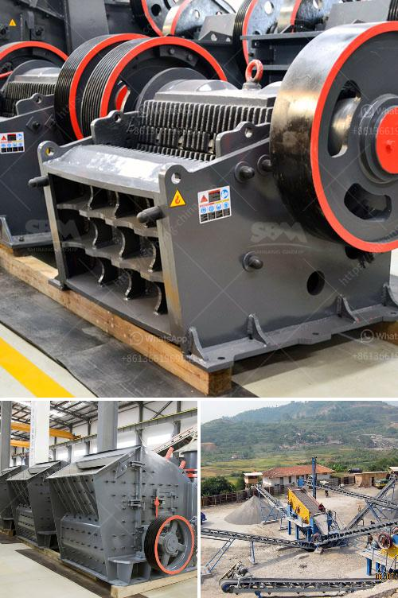

<h3>stone crusher plant design pdf</h3>
Stone crushing is the art and science of reducing large stones into small stones or gravel-sized stones. Stone crushing is an important industrial sector in many countries, especially in the developing world. Crushing primarily by compression, and some by shear and attrition, occurs when the material is fed into the crushing chamber and encounters a suitably hard and abrasive rock or mineral. Generally, the crushers are its primary components, enabling the machine to absorb large quantities of the material to be crushed. Other components, such as screeners, filters, conveyors, and magnets, also play an important role in defining the overall performance of the plant.

The main factors that influence the equipment selection in stone crushing plants are material characteristics, such as hardness, moisture content, and abrasiveness; the size distribution of the feed; and the required product size. The selection of the crusher type depends mainly on the mechanical properties of the rock.

When designing a stone crusher plant, a variety of factors are taken into consideration, including the nature of the raw materials, the site conditions, the desired product output, and the investment capital. Generally, the plant design should be based on the following principles:

1. Comprehensive design: The stone crusher plant should be designed for greater capacity, more efficient operation, and longer service life.

2. Compact design: Crushing plants have a lot of moving parts. Therefore, a compact design is essential to keeping the plant in operation and maximizing its value.

3. Simple design: Stone crusher plants are complex. They require a lot of machinery and equipment. Therefore, a simple yet functional design is essential to ensure a smooth operation of the plant.

4. Economical design: Stone crusher plants are expensive. They need to be built on a stable foundation to minimize expenses. That is why design engineers have to consider a variety of factors before deciding on the foundation design.

5. Environmentally friendly design: Stone crusher plants have to follow strict environmental standards. Therefore, a good design should employ energy-efficient equipment and make use of sustainable materials.

In conclusion, stone crusher plant design pdf provides a comprehensive overview of the factors that influence the plant layout and design, as well as ensuring the plant is efficiently and economically operated. It offers practical advice from experienced engineers and industry experts on how to design a plant efficiently and effectively. With careful planning and attention to detail, stone crushing plants can be built with confidence and offer years of reliable performance.
<h3>Contact us</h3><ul><li><strong>Whatsapp:&nbsp;<a href="https://wa.me/8613661969651">+8613661969651</a></strong></li><li><a href="https://swt.shibang-china.com/?git&amp;zhl&amp;stone crusher plant design pdf"><strong>Online Service(chat now)</strong></a></li></ul><h3>Related</h3><ul><li><a href='dolomite rock crusher.md'>dolomite rock crusher</a></li><li><a href='price of a set of stone crushing machine.md'>price of a set of stone crushing machine</a></li><li><a href='limestone quarry machines and equipments.md'>limestone quarry machines and equipments</a></li><li><a href='jual stone crusher philippines.md'>jual stone crusher philippines</a></li><li><a href='crushing plant for sale in.md'>crushing plant for sale in</a></li></ul>