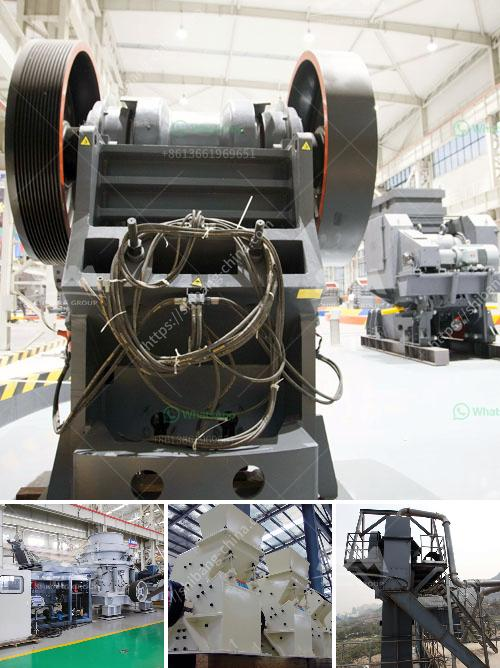

<h3>stone crusher plant for sale philippines</h3>
Stone crusher plant for sale Philippines, from DSMAC can supply and manufacture all types of stone crushing plant, such as 10-50tph, 50-100tph, 100-150tph, 150-250tph, 250-500tph, 500-1000tph etc. So, no matter for small scale or large scale stone crushing plants, DSMAC professionals can help designt a whole production line for stone crushing according to customers' special requirements.

DSMAC Stone crusher plant for sale in the Philippine can produce 40-500 tons per hour and can crush 8 to 10 inches diameter boulder capacity etc. Stone crusher or rock crusher is a kind of crushing machine, which can crush various large, medium and small sized ores, rocks (granite, lime stone and concrete). The granularity of the materials should be not more than 120-500mm and compression strength of the materials should be not more than 320MPa.

Stone crusher machine is widely used in mining, smelting, building materials, highways, railways, water conservancy, chemical industry and many other departments. Here are some cases for your reference. According to the specific requirements of customers, the stone crusher plant can be equipped with different crushing equipment. Screening equipment, feeding equipment, sand making equipment, conveying equipment and so on; auxiliary equipment such as pumps, dust-removing equipment, motors, brackets and so on.

Philippines is a country rich in basalt, granite, sand and gravel, iron ore, sand and stone producers; users can adopt a variety of configurations based on the type, size and processing raw materials and finished goods requirements of different users of mobile crushing and screening to meet the material requirements of different gradations.

In addition, the Philippines also has a good reputation for the design and produce such stone crusher plant equipment as the main products and vibrating feeder, screen, sand making machine, sand washing machine, and belt conveyor. Configuration of complete stone crusher plant equipment: vibrating feeder, jaw crusher, impact crusher, vibrating screen, belt conveyor, electric control system, etc. We design different production lines ranging 50t/h to 500t/h for customers' different production requirements.

3. The finished products are of uniform size, consistent shape and reasonable grade, which can be widely used in various fields;

4. The use of the most advanced technology and unique structural design, high processing efficiency, energy saving and environmental protection, stable performance, reliable quality.

In conclusion, stone crusher plant for sale in the Philippines is a useful tool for mining industry, construction industry, and other industry. DSMAC can provide a variety of configurations according to the requirements of customers, including stationary crushing plant, mobile crushing plant, etc. So no matter what kind of stone crushing plant you need, please contact us, and we can design the most suitable solution for you.
<h3>Contact us</h3><ul><li><strong>Whatsapp:&nbsp;<a href="https://wa.me/8613661969651">+8613661969651</a></strong></li><li><a href="https://swt.shibang-china.com/?git&amp;zhl&amp;stone crusher plant for sale philippines"><strong>Online Service(chat now)</strong></a></li></ul><h3>Related</h3><ul><li><a href='grinding mill for corundum.md'>grinding mill for corundum</a></li><li><a href='portable screening and drying sand.md'>portable screening and drying sand</a></li><li><a href='process of roll milling.md'>process of roll milling</a></li><li><a href='rock sand plant feasibility report.md'>rock sand plant feasibility report</a></li><li><a href='700t h mobile crusher.md'>700t h mobile crusher</a></li></ul>