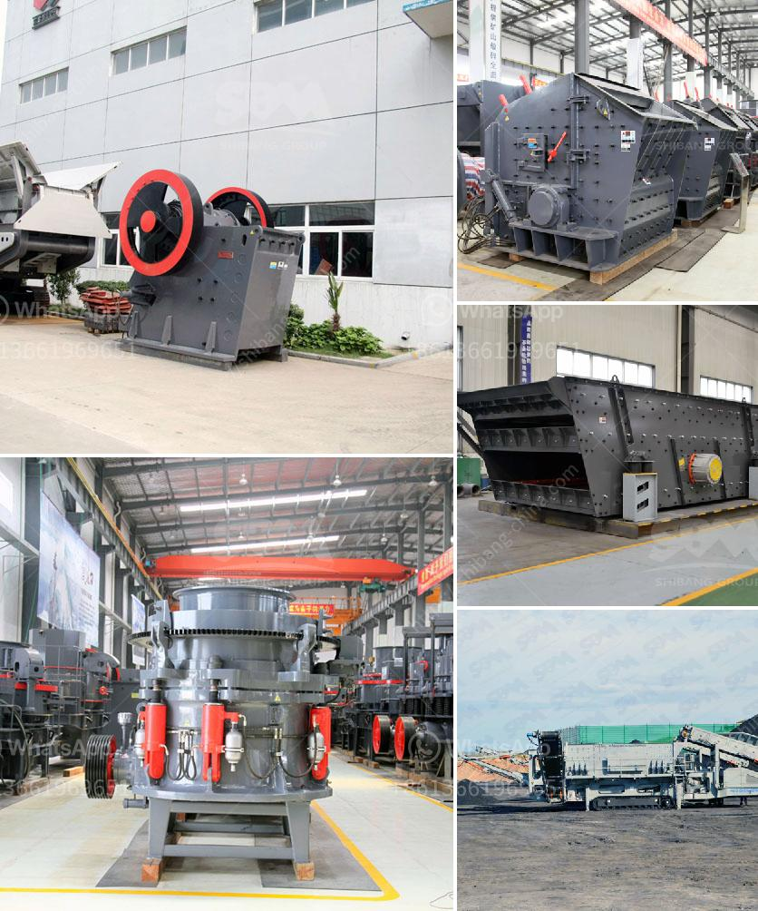

<h3>stone crusher plant manufacturer</h3>
Stone Crusher Plant Manufacturer - A Stone Crusher Plant Manufacturer is an important and reliable machinery producer situated in China. They furnish products with cutting-edge innovation and a stone processing capacity of 1-1000 tons per hour. They offer solutions that incorporate drilling, breaking, pulverizing, and transportation equipment, just as efficient screening and feeding machinery. The organization delivers exceptional, high-quality equipment to meet their customers' requirements and guarantee maximum profitability.

Being a leading manufacturer in the industry, they have been serving a large number of customers worldwide. They provide high-quality stone crushing plants and equipment at reasonable prices, which helps customers save a significant amount of money. Customers looking for a stone crusher plant manufacturer can rely on them to deliver the best products at competitive prices.

One of the key advantages of choosing this manufacturer is their commitment to customer satisfaction. They provide excellent after-sales service, ensuring that customers get the necessary support and assistance whenever required. Whether it is product installation, maintenance, or upgrade, they have a team of technicians ready to offer prompt assistance.

Furthermore, their manufacturing facilities are equipped with advanced machinery, including high-tech CNC machines, which ensure precision in every product. With a highly skilled workforce, the company is capable of producing top-quality equipment that meets international standards.

A stone crusher plant manufacturer offers comprehensive solutions to customers, assisting them in selecting the right equipment and optimizing their production processes. They work closely with their clients to understand their specific requirements and design customized solutions accordingly. By choosing the right equipment and implementing efficient processes, customers can improve their productivity and profitability.

In conclusion, a stone crusher plant manufacturer plays a crucial role in the construction and mining industry. With their high-quality equipment, excellent after-sales service, and commitment to customer satisfaction, they are a reliable choice for customers worldwide. Whether it is for large-scale projects or small-scale operations, they provide innovative solutions that meet the diverse needs of their customers.
<h3>Contact us</h3><ul><li><strong>Whatsapp:&nbsp;<a href="https://wa.me/8613661969651">+8613661969651</a></strong></li><li><a href="https://swt.shibang-china.com/?git&amp;zhl&amp;stone crusher plant manufacturer"><strong>Online Service(chat now)</strong></a></li></ul><h3>Related</h3><ul><li><a href='gold mining equipment in south africa for sale.md'>gold mining equipment in south africa for sale</a></li><li><a href='granite stones crusher.md'>granite stones crusher</a></li><li><a href='iron crushing equipment cost.md'>iron crushing equipment cost</a></li><li><a href='ball mill manufacture in chennai.md'>ball mill manufacture in chennai</a></li><li><a href='stone crusher plant for sale philippines.md'>stone crusher plant for sale philippines</a></li></ul>