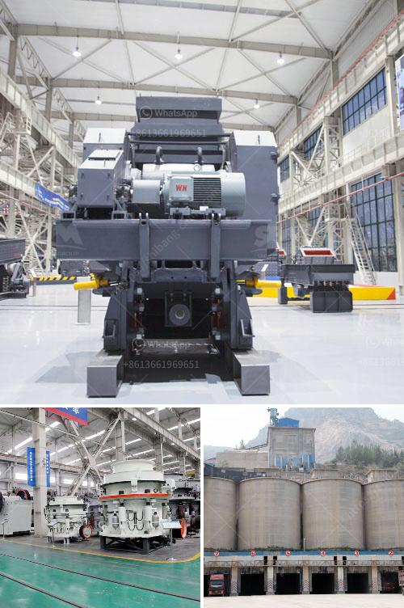

<h3>stone crusher plant pakistan feasibility report</h3>
Stone crushing plants are integral to the construction industry, as they produce the essential raw materials required for various construction projects. To understand the feasibility of a stone crushing plant, a feasibility study has been conducted, which focuses on analyzing the availability of raw materials, machinery and equipment, the market potential of the final products, and the financial feasibility of the project.

The study concluded that the demand for stone crushing products is ever-growing in Pakistan due to the increasing construction activities in the country. The availability of suitable raw materials such as stones, gravels, sand, and cement is abundant, making the project feasible and profitable. Additionally, the proposed stone crushing plant is located within a market area with ample suppliers and buyers.

The machinery and equipment required for the project include crushers, excavators, loaders, trucks, and other heavy machinery. The total cost of machinery and equipment is estimated to be approximately Rs. 20 million, which will be financed through a combination of owner’s equity and a bank loan.

The final products of the stone crushing plant will primarily serve as raw materials for various construction projects such as highways, bridges, tunnels, airports, and buildings. Construction materials such as concrete, asphalt, concrete blocks, and stones are all characterized by their high market value. The demand for these materials is constantly increasing in Pakistan, which makes the stone crushing plant an attractive investment opportunity.

The project also incorporates various environmental sustainability measures such as rainwater harvesting, waste recycling, and energy efficiency. These measures are in line with the government’s initiatives for sustainable development and will help reduce the project's environmental footprint.

Overall, the feasibility study concluded that a stone crushing plant in Pakistan can be economically and structurally viable with a capacity between 50-100 tons per hour. However, there are more factors to consider beyond the initial investment costs. The production scale and level of automation should be carefully evaluated to ensure the project's long-term profitability.

In conclusion, this feasibility study detailed the various aspects of establishing a stone crushing plant in Pakistan. It highlighted the availability of raw materials, machinery and equipment, market potential, and financial viability of the project. The project is expected to create employment opportunities for skilled and unskilled labor, stimulate the local economy, and contribute to the country’s infrastructure development.
<h3>Contact us</h3><ul><li><strong>Whatsapp:&nbsp;<a href="https://wa.me/8613661969651">+8613661969651</a></strong></li><li><a href="https://swt.shibang-china.com/?git&amp;zhl&amp;stone crusher plant pakistan feasibility report"><strong>Online Service(chat now)</strong></a></li></ul><h3>Related</h3><ul><li><a href='track mobile crusher.md'>track mobile crusher</a></li><li><a href='coal washing process machine.md'>coal washing process machine</a></li><li><a href='cost of crusher plant.md'>cost of crusher plant</a></li><li><a href='rental mesin stone crusher.md'>rental mesin stone crusher</a></li><li><a href='used toner powder making machine price.md'>used toner powder making machine price</a></li></ul>