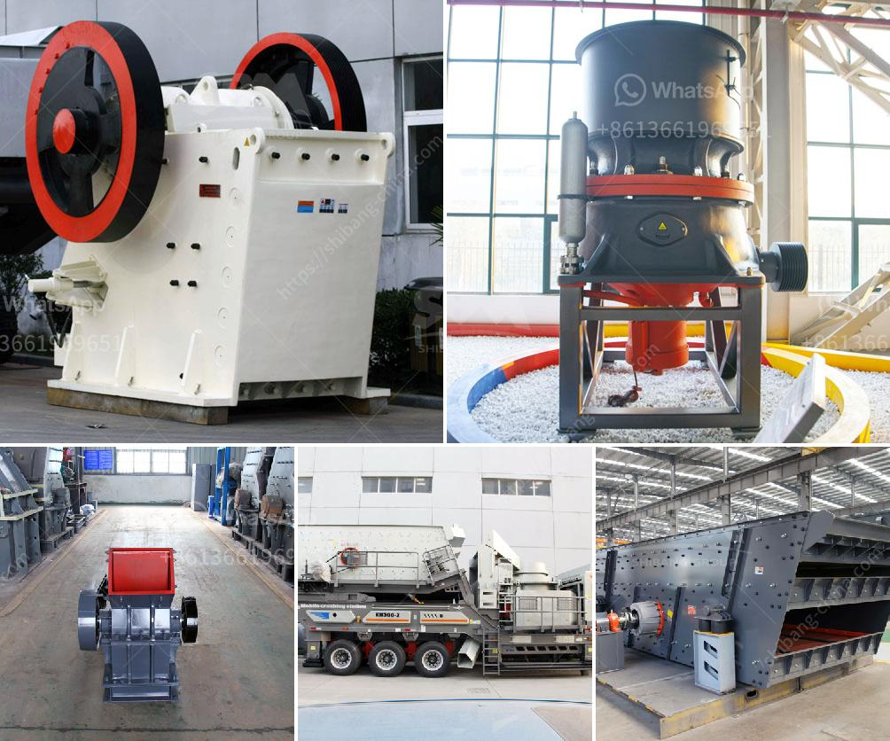

<h3>stone crusher plant supplier</h3>
The demand for stone crusher plants is on the rise, and it is not surprising that more and more mining companies are investing in these plants. Not only do these plants aid in boosting mineral production, but they also generate employment opportunities. With demand for these plants increasing, the need for a reliable stone crusher plant supplier is also on the rise.

When it comes to selecting a stone crusher plant supplier, there are numerous factors to be considered, including taxes, freight, warranties, and after-sales services. Amongst all these factors, choosing a reliable supplier is the most important decision a quarry or mine owner needs to make. Your supplier should be well-known throughout the industry and must have a proven track record of delivering high-quality stone crusher plants.

One such reputable supplier that excels in delivering top-notch stone crushing plants is AIMIX. This company not only guarantees exceptional crushing capabilities but also guarantees efficient transportation, uncomplicated installation, and excellent after-sales services. AIMIX focuses on satisfying its customers by providing the best value for their money.

AIMIX stone crusher plant supplier focuses on the needs of their customers and aims to exceed customer expectations. Their commitment to customer satisfaction has earned them an enviable reputation among quarry owners. An ISO certified supplier, AIMIX prides itself on being customer-centric, showcasing their dedication to offering exceptional service through every stage, from pre-sale consultation to after-sales support.

The stone crusher plants supplied by AIMIX have a longer operational life, offer a significantly higher productivity rate, and provide greater cost-effectiveness. They come with a standardized warranty and strict quality control measures. With the support of their experienced technical team, customers can be confident that their machines will be up and running in no time after installation.

In addition to providing first-rate stone crusher plants, AIMIX also offers customized solutions to suit the unique needs of its customers. With their expertise in this field, AIMIX ensures that the plants they supply are not only high-performing but also energy-efficient and environmentally friendly.

AIMIX stone crusher plant supplier adheres to the stringent international quality standards, providing excellent after-sales service, including commissioning, training, and maintenance. AIMIX's technical support team is always ready to assist customers through telephone or email, providing any technical support required.

Choosing the right stone crusher plant supplier is essential to the success of any quarry or mine project. The best suppliers are those that can provide timely delivery of reliable machines that meet the needs of their customers. AIMIX Group, a reputable crusher supplier, can offer you nearly any type of machine you need for crushing and screening.

Having been in the industry for more than three decades, AIMIX has extensive knowledge and experience in delivering high-performance stone crusher plants. With their commitment to meeting the growing demand for quality machinery, AIMIX is poised to become a leading stone crusher plant supplier in the mining industry.
<h3>Contact us</h3><ul><li><strong>Whatsapp:&nbsp;<a href="https://wa.me/8613661969651">+8613661969651</a></strong></li><li><a href="https://swt.shibang-china.com/?git&amp;zhl&amp;stone crusher plant supplier"><strong>Online Service(chat now)</strong></a></li></ul><h3>Related</h3><ul><li><a href='crushing plant in lahore.md'>crushing plant in lahore</a></li><li><a href='quartz crusher manufacturing process.md'>quartz crusher manufacturing process</a></li><li><a href='how to setup a stone quarry.md'>how to setup a stone quarry</a></li><li><a href='cone crusher csd 900 price.md'>cone crusher csd 900 price</a></li><li><a href='crushing of calcined bauxite.md'>crushing of calcined bauxite</a></li></ul>