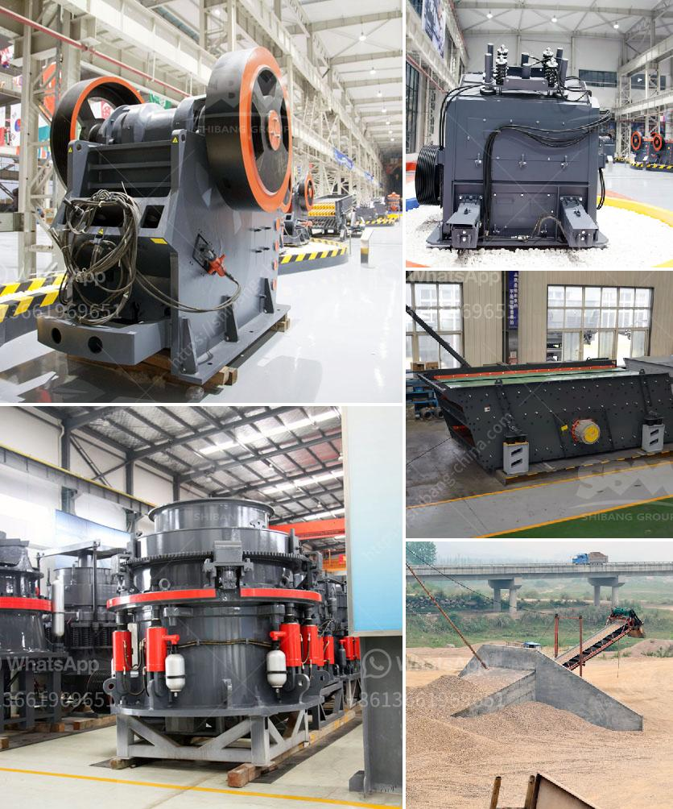

<h3>stone crusher plant ton jam</h3>
Stone crusher plant merupakan mesin pemecah batu yang digunakan untuk menghancurkan batu menjadi ukuran yang lebih kecil. Batu-batu yang telah dihancurkan tersebut kemudian digunakan sebagai bahan material untuk berbagai konstruksi, seperti jalan raya, bangunan, dan sebagainya.

Pada umumnya, stone crusher plant memiliki kapasitas yang bervariasi, mulai dari ton jam hingga beberapa ribu ton per jam. Kapasitas dari stone crusher plant sangat bergantung pada ukuran batu yang akan dihancurkan, tingkat kekerasan batu, serta tingkat produksi yang diinginkan.

Stone crusher plant yang memiliki kapasitas 100-300 ton/jam tergolong kecil hingga sedang. Meskipun ukurannya tidak terlalu besar, namun sudah cukup untuk menghasilkan batu pecah dengan ukuran yang dibutuhkan. Selain itu, stone crusher plant tersebut juga dilengkapi dengan berbagai peralatan pendukung untuk memaksimalkan proses penghancuran dan penyaringan batu.

Pendirian stone crusher plant ton jam tentunya membutuhkan investasi yang tidak sedikit. Namun, keberadaannya memberikan banyak manfaat bagi masyarakat sekitar, terutama dalam hal penambahan lapangan pekerjaan. Proses penghancuran batu menjadi material juga berkontribusi dalam pembangunan infrastruktur yang lebih baik.

Dalam memilih stone crusher plant ton jam, ada beberapa faktor yang perlu diperhatikan. Pertama, pastikan mesin yang digunakan memiliki tingkat efisiensi yang tinggi dan mudah dalam operasionalnya. Kedua, perhatikan juga mengenai ketersediaan suku cadang dari mesin tersebut untuk memastikan kelangsungan produksi.

Tidak kalah pentingnya adalah menjaga keberlanjutan operasional stone crusher plant tersebut melalui pemeliharaan yang rutin. Pengecekan dan perawatan teratur pada mesin serta pelumasan yang tepat dapat memperpanjang umur mesin dan memastikan kualitas batu hasil produksi tetap terjaga.

Dalam industri konstruksi, stone crusher plant dengan kapasitas 100-300 ton/jam menjadi pilihan yang ideal dalam menghasilkan batu pecah. Dengan kebutuhan material yang semakin meningkat, pendirian dan pengembangan stone crusher plant merupakan langkah yang tepat untuk memenuhi kebutuhan pasar serta memberikan manfaat positif bagi masyarakat.
<h3>Contact us</h3><ul><li><strong>Whatsapp:&nbsp;<a href="https://wa.me/8613661969651">+8613661969651</a></strong></li><li><a href="https://swt.shibang-china.com/?git&amp;zhl&amp;stone crusher plant ton jam"><strong>Online Service(chat now)</strong></a></li></ul><h3>Related</h3><ul><li><a href='gypsum grinding machine suppliers.md'>gypsum grinding machine suppliers</a></li><li><a href='gold mining equipment stores in tanzania.md'>gold mining equipment stores in tanzania</a></li><li><a href='buy stone crusher.md'>buy stone crusher</a></li><li><a href='suppliers kenya crusher.md'>suppliers kenya crusher</a></li><li><a href='stones crushing into building sand.md'>stones crushing into building sand</a></li></ul>