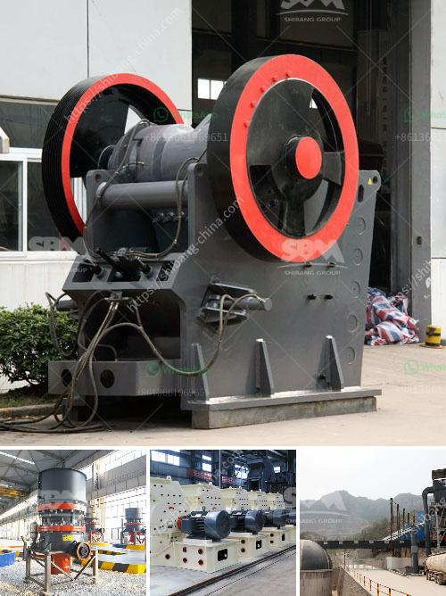

<h3>stone crusher saudi</h3>
Stone Crusher Saudi is commonly known as European jaw crusher, and is a new type of crusher developed by our company after the release of traditional jaw crusher. stone crusher machine price is a perfect combination of modern science and technology and the production practice, which can better satisfy the automatic production demands of vast customers.

Stone Crusher Saudi can be widely used in metal and nonmetal ores, cement, sand, metallurgy and other industries, suitable for the crushing various minerals and rocks whose Platt's hardness are less than 16, such as iron ore, nonferrous metal ore, granite, limestone , quartzite, sandstone, pebbles, etc. It is the indispensable machine in sand making industry and it is also the most ideal truing machine for mining and construction industries.

The motor drives the belt and belt pulley to make the moveable jaw move through the eccentric shaft. When movable jaw is rising, the included angle between the wrist plate and movable jaw becomes bigger to drive the movable plate to be close to the movable plate. At the same time the material is squeezed, rubbing, grinding and other multiple broken. The angle of Jaw Crusher between toggle plate and movable jaw decreases when movable jaw moves down, the movable jaw of Jaw Crusher moves away from fixed jaw by the pulling of rod and spring, the products after crushing will be discharged from the outlet of Jaw Crusher.

Stone Crusher Saudi is widely used in the works of mine, smelting, building materials, road, railway, irrigation,chemical industry etc. The crusher is applicable for the rough and medium crushing of rocks and ores with a compressive strength less than 320MPA. It is the preferred equipment of secondary crushing.

Stone Crusher Saudi is widely used in mining, metallurgy, construction, highway, railroad, and water conservancy, etc. for crushing various materials with compression strength less than 350MPa. It is preferred equipment for the complete product line as the primary crusher.

Primary jaw crusher is typically of the square opening design, and secondary jaw crusher is of the rectangular opening design. Jaw Crusher reduces large size rocks or ore by placing the rock into compression. A fixed jaw board, mounted in a "V" alignment is the stationary breaking surface, while the movable jaw exerts force on the rock by forcing it against the stationary plate. The space at the bottom of the "V" aligned jaw plates decides the crusher product size gap, or the size of the crushed product from the jaw crusher. The rock remains in the jaws until it is small enough to pass through the gap at the bottom of the jaws.
<h3>Contact us</h3><ul><li><strong>Whatsapp:&nbsp;<a href="https://wa.me/8613661969651">+8613661969651</a></strong></li><li><a href="https://swt.shibang-china.com/?git&amp;zhl&amp;stone crusher saudi"><strong>Online Service(chat now)</strong></a></li></ul><h3>Related</h3><ul><li><a href='iron ore concentrate plant tpa production.md'>iron ore concentrate plant tpa production</a></li><li><a href='rotary kiln producers in indonesia.md'>rotary kiln producers in indonesia</a></li><li><a href='quarry crusher equipment made in turkey.md'>quarry crusher equipment made in turkey</a></li><li><a href='bando rubber conveyor belt pdf.md'>bando rubber conveyor belt pdf</a></li><li><a href='balls level in ball mill.md'>balls level in ball mill</a></li></ul>