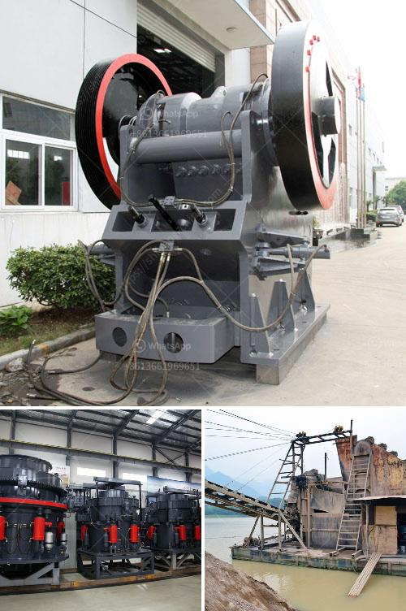

<h3>stone crusher supplier in orissa</h3>
A stone crusher supplier in Orissa is a talented and dedicated professional able to understand and meet the varied requirements of clients. Having been in the industry for quite a long time, the supplier has built a strong network of contacts with reputable manufacturers and distributors. This allows them to provide clients with high-quality products at competitive prices.

The stone crusher supplier in Orissa mainly produces jaw crusher, cone crusher, impact crusher, and hammer crusher. As for secondary crushing, there are cone crusher, ball mill, and impact crusher. Used rock crusher for sale in Orissa. It is used for primary crushing, jaw crusher, impact crusher, and cone crusher. The crushing plant can be equipped with vibrating screen and belt conveyor. With hundreds of projects under their belt, the stone crusher supplier in Orissa is confident in providing quality products and reliable services.

The stone crusher supplier in Orissa is meticulous in understanding clients' specific needs and delivering products as per their specifications. The supplier believes in providing solutions rather than just products, and strives to meet every customer's requirement by understanding their unique challenges. They have a team of experienced engineers and technicians who work collaboratively with clients to design and deliver customized crushing solutions.

Apart from providing high-quality products, the stone crusher supplier in Orissa also offers excellent after-sales services to clients. They have a dedicated team of service engineers who are available round the clock to address any technical issues or queries that clients may have. Whether it's installation, maintenance, or troubleshooting, the supplier ensures prompt and efficient assistance to ensure maximum customer satisfaction.

In conclusion, the stone crusher supplier in Orissa is dedicated to providing high-quality products and excellent services to clients. With long-term experience in the industry, they are able to understand clients' specific needs and deliver customized crushing solutions. Whether it's primary or secondary crushing, the supplier has a wide range of products to cater to diverse requirements. With their commitment to quality and customer satisfaction, the stone crusher supplier in Orissa is the ideal choice for all your crushing needs.
<h3>Contact us</h3><ul><li><strong>Whatsapp:&nbsp;<a href="https://wa.me/8613661969651">+8613661969651</a></strong></li><li><a href="https://swt.shibang-china.com/?git&amp;zhl&amp;stone crusher supplier in orissa"><strong>Online Service(chat now)</strong></a></li></ul><h3>Related</h3><ul><li><a href='copper processing equipment.md'>copper processing equipment</a></li><li><a href='impact crusher china.md'>impact crusher china</a></li><li><a href='mobile crushers for sale uk.md'>mobile crushers for sale uk</a></li><li><a href='mobile cone crushing station for sale.md'>mobile cone crushing station for sale</a></li><li><a href='jaw crusher saudi small capacity.md'>jaw crusher saudi small capacity</a></li></ul>