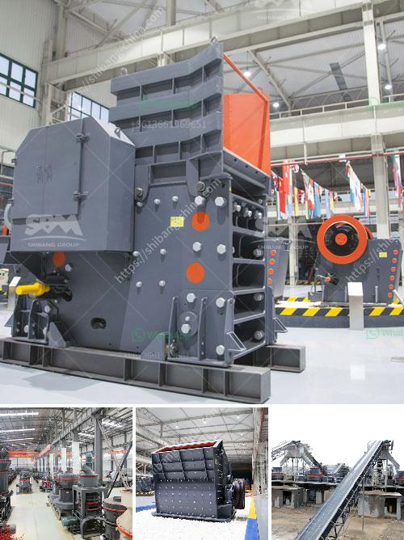

<h3>stone crusher with tractor</h3>
Stone crushers are essential machines in the mining and quarrying industry. They can crush large stones into gravel, smaller rocks, or even dust. Alongside their usage in construction and urban development, crushers also play a crucial role in creating a sustainable future.

The stone crusher with a tractor is a kind of special equipment for quantitatively crushing large stones into small stones. It can crushed stone and general machinery, realizing rapid conversion of raw materials and reduced time of transportation.

The stone crusher equipment has reliable performance, reasonable design, easy operation, high efficiency, and convenient maintenance. Its advantages include high productivity and high output, high reliability, and low energy consumption. However, there are also some disadvantages associated with these types of machines.

One of the main drawbacks is that the cost of a stone crusher machine is relatively high compared to other types of machines. Additionally, these machines are usually large, so transporting them from one location to another can be a challenging task. However, if you have access to a tractor, you can easily move these stone crushers to the desired location.

Using a tractor to power the stone crusher can save energy and electricity, and it greatly reduces the cost of transportation. When using the tractor for crushing, the machine body is installed with a seat for the operator, which provides a good working environment for them. The operator can sit comfortably and control the stone crusher easily using the tractor's power.

The stone crusher with a tractor is an ideal solution for road construction work, power tractors can be used to level the road base material and provide a reliable and sturdy surface for everything from forestry roads to public access roads. With the help of a tractor, this machinery can be easily and quickly moved from one place to another. This is especially useful in projects where the stone crushers need to be relocated frequently.

Moreover, stone crushers with tractors are also necessary for the construction, agricultural, and forestry sectors. They can be used to crush stones to create a gravel base for roads and buildings. They can also be used in fields for planting crops, as well as in forests for clearing the land or grinding the stumps.

In conclusion, stone crushers with tractors are an excellent investment for those looking to maximize productivity and efficiency in their operations. With their ability to crush large stones into small rocks and gravel, these machines offer a cost-effective solution for many industries. With proper maintenance and care, these crushers can provide years of reliable service and contribute to the development of a sustainable future.
<h3>Contact us</h3><ul><li><strong>Whatsapp:&nbsp;<a href="https://wa.me/8613661969651">+8613661969651</a></strong></li><li><a href="https://swt.shibang-china.com/?git&amp;zhl&amp;stone crusher with tractor"><strong>Online Service(chat now)</strong></a></li></ul><h3>Related</h3><ul><li><a href='used crusher for sale kenya.md'>used crusher for sale kenya</a></li><li><a href='cement plant machine.md'>cement plant machine</a></li><li><a href='pe jaw crusher.md'>pe jaw crusher</a></li><li><a href='cara menghitung biaya pemasangan stone crusher plant.md'>cara menghitung biaya pemasangan stone crusher plant</a></li><li><a href='crusher supplier in china.md'>crusher supplier in china</a></li></ul>